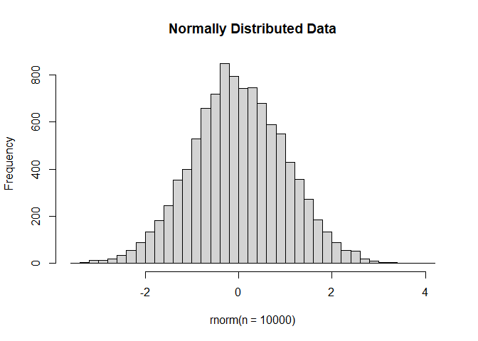

<script>
function buildQuiz(myq, qc){
  // variable to store the HTML output
  const output = [];

  // for each question...
  myq.forEach(
    (currentQuestion, questionNumber) => {

      // variable to store the list of possible answers
      const answers = [];

      // and for each available answer...
      for(letter in currentQuestion.answers){

        // ...add an HTML radio button
        answers.push(
          `<label>
            <input type="radio" name="question${questionNumber}" value="${letter}">
            ${letter} :
            ${currentQuestion.answers[letter]}
          </label><br/>`
        );
      }

      // add this question and its answers to the output
      output.push(
        `<div class="question"> ${currentQuestion.question} </div>
        <div class="answers"> ${answers.join('')} </div><br/>`
      );
    }
  );

  // finally combine our output list into one string of HTML and put it on the page
  qc.innerHTML = output.join('');
}

function showResults(myq, qc, rc){

  // gather answer containers from our quiz
  const answerContainers = qc.querySelectorAll('.answers');

  // keep track of user's answers
  let numCorrect = 0;

  // for each question...
  myq.forEach( (currentQuestion, questionNumber) => {

    // find selected answer
    const answerContainer = answerContainers[questionNumber];
    const selector = `input[name=question${questionNumber}]:checked`;
    const userAnswer = (answerContainer.querySelector(selector) || {}).value;

    // if answer is correct
    if(userAnswer === currentQuestion.correctAnswer){
      // add to the number of correct answers
      numCorrect++;

      // color the answers green
      answerContainers[questionNumber].style.color = 'lightgreen';
    }
    // if answer is wrong or blank
    else{
      // color the answers red
      answerContainers[questionNumber].style.color = 'red';
    }
  });

  // show number of correct answers out of total
  rc.innerHTML = `${numCorrect} out of ${myq.length}`;
}
</script>

# Differential Gene Expression Analysis in R
Differential Gene Expression (DGE) looks for genes whose expression changes in response to treatment or between groups.  

A lot of RNA-seq analysis has been done in R and so there are many packages available to analyze and view this data. Two of the most commonly used are:

* DESeq2, developed by Simon Anders (also created htseq) in Wolfgang Huber’s group at EMBL

* edgeR and Voom (extension to limma for RNA-seq), developed out of Gordon Smyth’s group from the Walter and Eliza Hall Institute of Medical Research in Australia

## Differential Expression Analysis with limma-Voom

**limma** is an R package that was originally developed for differential expression (DE) analysis of gene expression microarray data.

**voom** is a function in the limma package that transforms RNA-Seq data for use with limma.

Together they allow fast, flexible, and powerful analyses of RNA-Seq data.  Limma-voom is _our_ tool of choice for DE analyses because it:

* Allows for incredibly flexible model specification (you can include multiple categorical and continuous variables, allowing incorporation of almost any kind of metadata).

* Based on simulation studies, maintains the false discovery rate at or below the nominal rate, unlike some other packages.

* Empirical Bayes smoothing of gene-wise standard deviations provides increased power.  

### Basic Steps of Differential Gene Expression
1. Read count data into R

2. Calculate normalization factors (sample-specific adjustments for differences in e.g. read depth)

3. Filter genes (uninteresting genes, e.g. unexpressed)

4. Account for expression-dependent variability by transformation, weighting, or modeling

5. Fit a linear model (or generalized linear model, or nonparametric model)

6. Perform statistical comparisons of interest (using contrasts)

7. Adjust for multiple testing, Benjamini-Hochberg (BH) or q-value

8. Check results for confidence

9. Attach annotation if available and write tables


```r
library(edgeR)
library(RColorBrewer)
library(gplots)
```

### The dataset
The data used in the example are from [Kurtulus et al.](https://www.ncbi.nlm.nih.gov/pmc/articles/PMC6336113/) and are from mouse CD8+ T cells.  We use the portion of the experiment in which they identified three T-cell subsets:

* CD62L-Slamf7hiCX3CR1- ("memory precursor like"), 5 samples

* CD62L-Slamf7hiCX3CR1+ ("effector like), 3 samples

* CD62LhiSlamf7-CX3CR1- ("naive like"), 6 samples

The data used in this example were obtained from [SRA](https://www.ncbi.nlm.nih.gov/bioproject/PRJNA507017), preprocessed using HTStream, and aligned and counted using STAR.

### The counts table

The counts table we will use for our differential expression analysis is of the following format:

* One column for every sample

* One row for every gene in the annotation .gtf file used for alignment

* Elements are the raw counts of reads aligning to a given gene for a given sample

## 1. Read in the counts table and create our DGEList object


```r
counts <- read.delim("counts_for_course.txt", row.names = 1)
head(counts)
```

<div class='r_output'>                      SRR8245064 SRR8245065 SRR8245066 SRR8245067 SRR8245068
 ENSMUSG00000102693.2          3          0          0          0          0
 ENSMUSG00000064842.3          0          0          0          0          0
 ENSMUSG00000051951.6          8         27         16          5          5
 ENSMUSG00000102851.2          0          0          3          0          0
 ENSMUSG00000103377.2         13          0          2          7          2
 ENSMUSG00000104017.2          7          1          7          6         11
                      SRR8245069 SRR8245070 SRR8245071 SRR8245072 SRR8245073
 ENSMUSG00000102693.2          0          1          0          0          0
 ENSMUSG00000064842.3          0          0          0          0          0
 ENSMUSG00000051951.6          9          6          5          2          0
 ENSMUSG00000102851.2          0          0          0          0          0
 ENSMUSG00000103377.2          0          0          0          0          0
 ENSMUSG00000104017.2         30          5          0          0          0
                      SRR8245074 SRR8245075 SRR8245076 SRR8245077
 ENSMUSG00000102693.2          0          0          0          3
 ENSMUSG00000064842.3          0          0          0          0
 ENSMUSG00000051951.6          0          0          0          1
 ENSMUSG00000102851.2          0          0          0          0
 ENSMUSG00000103377.2          0          0          1          0
 ENSMUSG00000104017.2          2         21          0          1
</div>
Create Differential Gene Expression List Object (DGEList) object 

A DGEList is an object in the package edgeR for storing count data, normalization factors, and other information


```r
d0 <- DGEList(counts)
```

**1a\.** Read in Annotation

```r
anno <- read.delim("annotation.txt")
dim(anno)
```

<div class='r_output'> [1] 55414     3
</div>
```r
head(anno)
```

<div class='r_output'>       Gene.stable.ID
 1 ENSMUSG00000064336
 2 ENSMUSG00000064337
 3 ENSMUSG00000064338
 4 ENSMUSG00000064339
 5 ENSMUSG00000064340
 6 ENSMUSG00000064341
                                                                  Gene.description
 1   mitochondrially encoded tRNA phenylalanine [Source:MGI Symbol;Acc:MGI:102487]
 2             mitochondrially encoded 12S rRNA [Source:MGI Symbol;Acc:MGI:102493]
 3          mitochondrially encoded tRNA valine [Source:MGI Symbol;Acc:MGI:102472]
 4             mitochondrially encoded 16S rRNA [Source:MGI Symbol;Acc:MGI:102492]
 5       mitochondrially encoded tRNA leucine 1 [Source:MGI Symbol;Acc:MGI:102482]
 6 mitochondrially encoded NADH dehydrogenase 1 [Source:MGI Symbol;Acc:MGI:101787]
   Gene.name
 1     mt-Tf
 2   mt-Rnr1
 3     mt-Tv
 4   mt-Rnr2
 5    mt-Tl1
 6    mt-Nd1
</div>
```r
tail(anno)
```

<div class='r_output'>           Gene.stable.ID
 55409 ENSMUSG00000044103
 55410 ENSMUSG00000026984
 55411 ENSMUSG00000104173
 55412 ENSMUSG00000083172
 55413 ENSMUSG00000026983
 55414 ENSMUSG00000046845
                                                             Gene.description
 55409                    interleukin 36G [Source:MGI Symbol;Acc:MGI:2449929]
 55410                    interleukin 36A [Source:MGI Symbol;Acc:MGI:1859324]
 55411              predicted gene, 37703 [Source:MGI Symbol;Acc:MGI:5610931]
 55412               predicted gene 13409 [Source:MGI Symbol;Acc:MGI:3651609]
 55413 interleukin 36 receptor antagonist [Source:MGI Symbol;Acc:MGI:1859325]
 55414    interleukin 1 family, member 10 [Source:MGI Symbol;Acc:MGI:2652548]
       Gene.name
 55409     Il36g
 55410     Il36a
 55411   Gm37703
 55412   Gm13409
 55413    Il36rn
 55414    Il1f10
</div>
```r
any(duplicated(anno$Gene.stable.ID))
```

<div class='r_output'> [1] FALSE
</div>

**1b\.** Read in metadata
Metadata for this experiment is in a separate .csv file.


```r
metadata <- read.csv("metadata_for_course.csv")
head(metadata)
```

<div class='r_output'>          Run             Cell_type  simplified_cell_type
 1 SRR8245064 CD62L-Slamf7hiCX3CR1- memory_precursor_like
 2 SRR8245065 CD62L-Slamf7hiCX3CR1- memory_precursor_like
 3 SRR8245066 CD62L-Slamf7hiCX3CR1- memory_precursor_like
 4 SRR8245067 CD62L-Slamf7hiCX3CR1- memory_precursor_like
 5 SRR8245068 CD62L-Slamf7hiCX3CR1- memory_precursor_like
 6 SRR8245069 CD62L-Slamf7hiCX3CR1+         effector_like
</div>

It's very important to check that the samples are in the same order in the metadata and in the counts table, particularly since no errors will be generated if they aren't--you'll just get nonsense results.


```r
identical(metadata$Run, colnames(counts))
```

<div class='r_output'> [1] TRUE
</div>

If they weren't in the same order, you could do the following (this only works if there aren't any extra samples in the metadata that aren't present in the counts table)


```r
# counts <- counts[,metadata$Run]
```

## Quiz 1
<div id="quiz1" class="quiz"></div>
<button id="submit1">Submit Quiz</button>
<div id="results1" class="output"></div>
<script>
quizContainer1 = document.getElementById('quiz1');
resultsContainer1 = document.getElementById('results1');
submitButton1 = document.getElementById('submit1');
myQuestions1 = [
  {
    question: "How many genes are in the counts table",
    answers: {
      a: "14",
      b: "55,357",
      c: "34,830,104",
    },
    correctAnswer: "b"
  },
  {
    question: "How many samples are in the counts table",
    answers: {
      a: "14",
      b: "55,357",
      c: "34,830,104",
    },
    correctAnswer: "a"
  },
  {
    question: "What is the total count across all genes for sample SRR8245064",
    answers: {
      a: "10,000",
      b: "2,182,122",
      c: "2,187,918"
    },
    correctAnswer: "c"
  },
  {
    question: "'Extra-credit' question: How many genes have a count of 0 in every sample?",
    answers: {
      a: "42,730",
      b: "12,627",
      c: "55,357"
    },
    correctAnswer: "b"
  }
];
buildQuiz(myQuestions1, quizContainer1);
submitButton1.addEventListener('click', function() {showResults(myQuestions1, quizContainer1, resultsContainer1);});
</script>

## 2. Preprocessing and Normalization factors

In differential expression analysis, only sample-specific effects need to be normalized, we are NOT concerned with comparisons and quantification of absolute expression.

* Sequence depth – is a sample specific effect and needs to be adjusted for. This is often done finding a set of scaling factors for the library sizes that minimize the log-fold changes between the samples for most genes (edgeR uses a trimmed mean of M-values between each pair of sample)

* GC content – is NOT sample-specific (except when it is)

* Gene Length – is NOT sample-specific (except when it is)

In edgeR/limma, you calculate normalization factors to scale the raw library sizes (number of reads) using the function calcNormFactors, which by default uses TMM (weighted trimmed means of M values to the reference). Assumes most genes are not DE.

Proposed by Robinson and Oshlack (2010).


```r
d0 <- calcNormFactors(d0)
d0$samples
```

<div class='r_output'>            group lib.size norm.factors
 SRR8245064     1  2187918    1.0228563
 SRR8245065     1  2187296    0.9815884
 SRR8245066     1  2257941    1.0327749
 SRR8245067     1  2182122    0.9740615
 SRR8245068     1  2568324    0.9903715
 SRR8245069     1  2819611    1.0463543
 SRR8245070     1  2385233    1.0202906
 SRR8245071     1  2121771    0.9566739
 SRR8245072     1  2740431    0.9862707
 SRR8245073     1  2631794    1.0029208
 SRR8245074     1  2610388    0.9939809
 SRR8245075     1  2517395    0.9968237
 SRR8245076     1  2678907    0.9811120
 SRR8245077     1  2940973    1.0179384
</div>

**Note:** calcNormFactors doesn't _normalize_ the data, it just calculates normalization factors for use downstream.


## 3. Filtering genes
We filter genes based on non-experimental factors to reduce the number of genes/tests being conducted and therefor do not have to be accounted for in our transformation or multiple testing correction. Commonly we try to remove genes that are either a) unexpressed, or b) unchanging (low-variability).

Common filters include:

1. Remove genes with a max value (X) of less then Y.

2. Remove genes that are less than X normalized read counts (cpm) across a certain number of samples. Ex: rowSums(cpms <=1) < 3 , require at least 1 cpm in at least 3 samples to keep.

3. A less used filter is for genes with minimum variance across all samples, so if a gene isn't changing (constant expression) its inherently not interesting therefor no need to test.


Here we use the built-in edgeR function `filterByExpr` which essentially requires a gene to have a normalized count of at least 10 in at least k samples, where k is the smallest group size.  (Also includes generalization of this approach to complex experimental designs).


In order to use `filterByExpr` we need to specify the design matrix for our experiment.  This specifies the statistical model for use in filtering, variance weighting, and differential expression.  We use a model where each fitted coefficient is the mean of one of the groups.


```r
mm <- model.matrix(~0 + simplified_cell_type, data = metadata)
mm
```

<div class='r_output'>    simplified_cell_typeeffector_like simplified_cell_typememory_precursor_like
 1                                  0                                         1
 2                                  0                                         1
 3                                  0                                         1
 4                                  0                                         1
 5                                  0                                         1
 6                                  1                                         0
 7                                  1                                         0
 8                                  1                                         0
 9                                  0                                         0
 10                                 0                                         0
 11                                 0                                         0
 12                                 0                                         0
 13                                 0                                         0
 14                                 0                                         0
    simplified_cell_typenaive_like
 1                               0
 2                               0
 3                               0
 4                               0
 5                               0
 6                               0
 7                               0
 8                               0
 9                               1
 10                              1
 11                              1
 12                              1
 13                              1
 14                              1
 attr(,"assign")
 [1] 1 1 1
 attr(,"contrasts")
 attr(,"contrasts")$simplified_cell_type
 [1] "contr.treatment"
</div>

Back to filtering

```r
keep <- filterByExpr(d0, mm)
sum(keep) # number of genes retained
```

<div class='r_output'> [1] 13741
</div>
```r
d <- d0[keep,]
```


Visualizing your data with a Multidimensional scaling (MDS) plot.


```r
plotMDS(d, col = as.numeric(factor(metadata$simplified_cell_type)), cex = 1)
legend("bottomright", text.col = 1:3, legend = levels(factor(metadata$simplified_cell_type)), cex = 0.8)
```

<!-- -->


The MDS plot tells you **A LOT** about what to expect from your experiment.

**3a\.** Extracting "normalized" expression table
We use the `cpm` function with log=TRUE to obtain log-transformed normalized expression data.  On the log scale, the data has less mean-dependent variability and is more suitable for plotting.


```r
logcpm <- cpm(d, log=TRUE)
write.table(logcpm,"rnaseq_workshop_normalized_counts.txt",sep="\t",quote=F)
```

## Quiz 2
<div id="quiz2" class="quiz"></div>
<button id="submit2">Submit Quiz</button>
<div id="results2" class="output"></div>
<script>
quizContainer2 = document.getElementById('quiz2');
resultsContainer2 = document.getElementById('results2');
submitButton2 = document.getElementById('submit2');
myQuestions2 = [
  {
    question: "Which sample has the largest normalization factor?",
    answers: {
      a: "SRR8245071",
      b: "SRR8245069",
      c: "SRR8245066",
    },
    correctAnswer: "b"
  },
  {
    question: "Is the sample with the largest normalization factor the sample with the smallest total counts?",
    answers: {
      a: "TRUE",
      b: "FALSE"
    },
    correctAnswer: "b"
  },
  {
    question: "Make an MDS plot of the unfiltered data.  How does it differ from the MDS plot of the filtered data?",
    answers: {
      a: "The axis ranges are larger",
      b: "There is less separation",
      c: "The plots are nearly identical"
    },
    correctAnswer: "c"
  }
];
buildQuiz(myQuestions2, quizContainer2);
submitButton2.addEventListener('click', function() {showResults(myQuestions2, quizContainer2, resultsContainer2);});
</script>

## 4. Voom transformation and calculation of variance weights
The `voom` is used to obtain variance weights for use in downstream statistical modelling, which assumes that the variability of a gene is independent of its expression.


**4a\.** **Voom**

```r
y <- voom(d, mm, plot = T)
```

<!-- -->


What is voom doing?

1. Counts are transformed to log2 counts per million reads (CPM), where "per million reads" is defined based on the normalization factors we calculated earlier.

2. A linear model is fitted to the log2 CPM for each gene, and the residuals are calculated.

3. A smoothed curve is fitted to the sqrt(residual standard deviation) by average expression.
(see red line in plot above)

4. The smoothed curve is used to obtain weights for each gene and sample that are passed into limma along with the log2 CPMs.

More details at "[voom: precision weights unlock linear model analysis tools for RNA-seq read counts](https://genomebiology.biomedcentral.com/articles/10.1186/gb-2014-15-2-r29)"

If your voom plot looks like the below (performed on the raw data), you might want to filter more:


```r
tmp <- voom(d0, mm, plot = T)
```

<!-- -->


## 5. Fitting linear models in limma
lmFit fits a linear model using weighted least squares for each gene:


```r
fit <- lmFit(y, mm)
head(coef(fit))
```

<div class='r_output'>                       simplified_cell_typeeffector_like
 ENSMUSG00000104017.2                          1.0581142
 ENSMUSG00000025900.14                         0.8247494
 ENSMUSG00000033845.14                         5.9751519
 ENSMUSG00000025903.15                         6.4960704
 ENSMUSG00000033813.16                         5.5836994
 ENSMUSG00000033793.13                         6.7336026
                       simplified_cell_typememory_precursor_like
 ENSMUSG00000104017.2                                   1.366092
 ENSMUSG00000025900.14                                  1.817405
 ENSMUSG00000033845.14                                  6.123220
 ENSMUSG00000025903.15                                  6.537393
 ENSMUSG00000033813.16                                  5.543657
 ENSMUSG00000033793.13                                  7.242839
                       simplified_cell_typenaive_like
 ENSMUSG00000104017.2                      -0.8858157
 ENSMUSG00000025900.14                     -0.1645845
 ENSMUSG00000033845.14                      5.8741078
 ENSMUSG00000025903.15                      6.1799819
 ENSMUSG00000033813.16                      5.4037780
 ENSMUSG00000033793.13                      6.9410105
</div>

Comparisons between groups (log fold-changes) are obtained as _contrasts_ of these fitted linear models.

## 6. Specify which groups to compare using contrasts:
Comparison between naive-like and memory precursor-like


```r
contr <- makeContrasts(simplified_cell_typenaive_like - simplified_cell_typememory_precursor_like, levels = colnames(coef(fit)))
```


**6a\.** Estimate contrast for each gene

```r
tmp <- contrasts.fit(fit, contr)
```

Some genes may have particularly high or low variability even after transformation and weighting due to random variability, particularly with small sample sizes.  Empirical Bayes smoothing of standard errors of log fold changes helps with this (shifts standard errors that are much larger or smaller than those from other genes towards the average standard error) (see "[Linear Models and Empirical Bayes Methods for Assessing Differential Expression in Microarray Experiments](https://www.degruyter.com/doi/10.2202/1544-6115.1027)"

**6b\.** Apply EBayes

```r
tmp <- eBayes(tmp)
```


## 7. Multiple Testing Adjustment
The topTable function reports sorted DE results and adjusts for multiple testing using method of Benjamini & Hochberg (BH), or its 'alias' fdr. "[Controlling the false discovery rate: a practical and powerful approach to multiple testing](http://www.jstor.org/stable/2346101).

here `n=Inf` says to produce the topTable for **all** genes. 


```r
top.table <- topTable(tmp, adjust.method = "BH", sort.by = "P", n = Inf)
head(top.table)
```

<div class='r_output'>                           logFC   AveExpr          t      P.Value    adj.P.Val
 ENSMUSG00000000782.17  1.130285  9.058521  10.555268 1.124296e-08 8.804950e-05
 ENSMUSG00000025017.11 -1.682138  7.213869 -10.284366 1.627415e-08 8.804950e-05
 ENSMUSG00000045092.9   1.502989  8.309417  10.164093 1.922338e-08 8.804950e-05
 ENSMUSG00000018899.18  1.145045 10.180757   9.810120 3.165608e-08 9.674879e-05
 ENSMUSG00000042385.15 -3.575618  5.530089  -9.735911 3.520442e-08 9.674879e-05
 ENSMUSG00000023132.9  -2.546520  7.426342  -9.286015 6.790147e-08 1.271304e-04
                               B
 ENSMUSG00000000782.17 10.227212
 ENSMUSG00000025017.11  9.902773
 ENSMUSG00000045092.9   9.758351
 ENSMUSG00000018899.18  9.086943
 ENSMUSG00000042385.15  8.242216
 ENSMUSG00000023132.9   8.487412
</div>

### Multiple Testing Correction
In 'omics experiments, multiple testing correction is the standard in the field. Best choices are:

* [FDR](http://www.jstor.org/stable/2346101) (false discovery rate), such as Benjamini-Hochberg (1995).

* [Qvalue](https://rss.onlinelibrary.wiley.com/doi/abs/10.1111/1467-9868.00346) - Storey (2002)


The FDR-adjusted p-value (or qvalue) is a statement about the list and is no longer about the gene (pvalue). So a FDR of 0.05, says you expect 5% false positives among the list of genes with an FDR of 0.05 or less.

The statement “Statistically significantly different” means FDR of 0.05 or less.


**7a\.** How many DE genes are there (false discovery rate corrected)?

```r
length(which(top.table$adj.P.Val < 0.05))
```

<div class='r_output'> [1] 791
</div>

## 8. Merge in annotation, check your results for confidence
You've conducted an experiment, you've seen a phenotype. Now check which genes are most differentially expressed (show the top 50)? Look up these top genes, their description and ensure they relate to your experiment/phenotype. 


```r
top.table$Gene.stable.ID <- sapply(strsplit(rownames(top.table), split = ".", fixed = TRUE), `[`, 1)
ord <- match(top.table$Gene.stable.ID, anno$Gene.stable.ID)
top.table$Gene.name <- anno$Gene.name[ord]
top.table$Gene.description <- anno$Gene.description[ord]
head(top.table, 50)
```

<div class='r_output'>                            logFC   AveExpr          t      P.Value    adj.P.Val
 ENSMUSG00000000782.17  1.1302851  9.058521  10.555268 1.124296e-08 8.804950e-05
 ENSMUSG00000025017.11 -1.6821378  7.213869 -10.284366 1.627415e-08 8.804950e-05
 ENSMUSG00000045092.9   1.5029891  8.309417  10.164093 1.922338e-08 8.804950e-05
 ENSMUSG00000018899.18  1.1450449 10.180757   9.810120 3.165608e-08 9.674879e-05
 ENSMUSG00000042385.15 -3.5756182  5.530089  -9.735911 3.520442e-08 9.674879e-05
 ENSMUSG00000023132.9  -2.5465202  7.426342  -9.286015 6.790147e-08 1.271304e-04
 ENSMUSG00000039384.9   1.5770259  7.143061   9.253002 7.131760e-08 1.271304e-04
 ENSMUSG00000020297.11  1.5685238  5.717637   9.228085 7.401524e-08 1.271304e-04
 ENSMUSG00000029322.13 -0.9965664  8.530502  -8.928161 1.163675e-07 1.595087e-04
 ENSMUSG00000079227.11 -1.8028257  7.363926  -8.889597 1.234318e-07 1.595087e-04
 ENSMUSG00000091191.4   1.1655304  8.096354   8.867453 1.276905e-07 1.595087e-04
 ENSMUSG00000034349.15  0.9635573  8.806433   8.802807 1.410287e-07 1.614897e-04
 ENSMUSG00000075010.6  -0.9916741  9.340376  -8.568709 2.029396e-07 2.115879e-04
 ENSMUSG00000028965.14 -3.4791121  6.870204  -8.530260 2.155761e-07 2.115879e-04
 ENSMUSG00000053113.4   0.9340731  9.409133   8.483067 2.322238e-07 2.127325e-04
 ENSMUSG00000040270.17  1.5841439  5.775190   8.439930 2.486223e-07 2.135199e-04
 ENSMUSG00000030167.16 -1.8562225  7.625575  -8.283338 3.191151e-07 2.579389e-04
 ENSMUSG00000018930.4  -2.1344241  7.532782  -8.237988 3.432334e-07 2.611590e-04
 ENSMUSG00000006519.12 -0.9477292  7.960790  -8.186883 3.727180e-07 2.611590e-04
 ENSMUSG00000030830.19 -0.9705894  9.576101  -8.170408 3.827791e-07 2.611590e-04
 ENSMUSG00000020034.8   1.1967576  7.624316   8.144592 3.991223e-07 2.611590e-04
 ENSMUSG00000050052.13  1.8442832  5.375312   8.115847 4.181825e-07 2.611930e-04
 ENSMUSG00000015316.12 -2.0036280  6.464671  -8.075912 4.462601e-07 2.643524e-04
 ENSMUSG00000027985.15  1.4793843  8.147842   8.038014 4.747355e-07 2.643524e-04
 ENSMUSG00000021728.9   0.7288742 10.403827   8.014290 4.935249e-07 2.643524e-04
 ENSMUSG00000112023.2  -1.4291587  9.056751  -7.969731 5.309510e-07 2.643524e-04
 ENSMUSG00000112148.2  -1.7723555  6.655343  -7.962553 5.372527e-07 2.643524e-04
 ENSMUSG00000021109.14 -0.8723171  8.468304  -7.960950 5.386701e-07 2.643524e-04
 ENSMUSG00000017561.17  0.8127188  8.269992   7.771147 7.376954e-07 3.495404e-04
 ENSMUSG00000020978.11  1.3479712  7.269913   7.709689 8.175741e-07 3.744762e-04
 ENSMUSG00000049775.17 -0.8026414  9.941892  -7.575732 1.024685e-06 4.541997e-04
 ENSMUSG00000026581.15  0.8419716  9.125156   7.530063 1.107278e-06 4.692204e-04
 ENSMUSG00000030149.16 -1.4446697  8.593087  -7.519754 1.126867e-06 4.692204e-04
 ENSMUSG00000029084.6  -1.5435018  5.647269  -7.479330 1.207245e-06 4.879046e-04
 ENSMUSG00000015437.6  -2.8112472  9.468327  -7.439288 1.292793e-06 5.039672e-04
 ENSMUSG00000037944.9   1.3602527  8.954916   7.426980 1.320342e-06 5.039672e-04
 ENSMUSG00000004612.10 -0.7844487  9.918711  -7.198847 1.958934e-06 7.146273e-04
 ENSMUSG00000022696.18  0.8821514  8.299524   7.193800 1.976263e-06 7.146273e-04
 ENSMUSG00000005470.9  -2.0638904  4.505179  -7.144746 2.153258e-06 7.586645e-04
 ENSMUSG00000025747.13 -1.7535015  4.808162  -7.074781 2.434843e-06 8.364296e-04
 ENSMUSG00000002897.6   0.8709059  8.223009   7.055535 2.518859e-06 8.364890e-04
 ENSMUSG00000024251.11  1.1074968  7.517188   7.034434 2.614455e-06 8.364890e-04
 ENSMUSG00000038894.8   1.7338348  5.066124   7.033745 2.617643e-06 8.364890e-04
 ENSMUSG00000020315.19  0.9573338  7.293769   7.009749 2.731119e-06 8.529160e-04
 ENSMUSG00000066278.7   0.9187533 10.001012   6.877183 3.457565e-06 1.055787e-03
 ENSMUSG00000018209.16  0.8270881  7.655715   6.857458 3.581790e-06 1.069943e-03
 ENSMUSG00000049103.15 -1.8253828  6.871028  -6.844042 3.668933e-06 1.072656e-03
 ENSMUSG00000075602.11 -1.5627410  8.403295  -6.784283 4.084807e-06 1.142292e-03
 ENSMUSG00000055170.5  -2.2019101  5.076920  -6.782063 4.101173e-06 1.142292e-03
 ENSMUSG00000020372.16  0.4616605 10.515691   6.774624 4.156509e-06 1.142292e-03
                               B     Gene.stable.ID Gene.name
 ENSMUSG00000000782.17 10.227212 ENSMUSG00000000782      Tcf7
 ENSMUSG00000025017.11  9.902773 ENSMUSG00000025017   Pik3ap1
 ENSMUSG00000045092.9   9.758351 ENSMUSG00000045092     S1pr1
 ENSMUSG00000018899.18  9.086943 ENSMUSG00000018899      Irf1
 ENSMUSG00000042385.15  8.242216 ENSMUSG00000042385      Gzmk
 ENSMUSG00000023132.9   8.487412 ENSMUSG00000023132      Gzma
 ENSMUSG00000039384.9   8.481685 ENSMUSG00000039384    Dusp10
 ENSMUSG00000020297.11  8.376917 ENSMUSG00000020297      Nsg2
 ENSMUSG00000029322.13  7.908075 ENSMUSG00000029322     Plac8
 ENSMUSG00000079227.11  7.945640 ENSMUSG00000079227      Ccr5
 ENSMUSG00000091191.4   7.885146 ENSMUSG00000091191   Gm17334
 ENSMUSG00000034349.15  7.698005 ENSMUSG00000034349      Smc4
 ENSMUSG00000075010.6   7.277665 ENSMUSG00000075010  AW112010
 ENSMUSG00000028965.14  7.356462 ENSMUSG00000028965   Tnfrsf9
 ENSMUSG00000053113.4   7.134404 ENSMUSG00000053113     Socs3
 ENSMUSG00000040270.17  7.177477 ENSMUSG00000040270     Bach2
 ENSMUSG00000030167.16  7.005214 ENSMUSG00000030167     Klrc1
 ENSMUSG00000018930.4   6.942369 ENSMUSG00000018930      Ccl4
 ENSMUSG00000006519.12  6.818249 ENSMUSG00000006519      Cyba
 ENSMUSG00000030830.19  6.622206 ENSMUSG00000030830     Itgal
 ENSMUSG00000020034.8   6.771345 ENSMUSG00000020034   Tcp11l2
 ENSMUSG00000050052.13  6.691590 ENSMUSG00000050052      Tdrp
 ENSMUSG00000015316.12  6.676951 ENSMUSG00000015316    Slamf1
 ENSMUSG00000027985.15  6.559325 ENSMUSG00000027985      Lef1
 ENSMUSG00000021728.9   6.186829 ENSMUSG00000021728       Emb
 ENSMUSG00000112023.2   6.360248 ENSMUSG00000112023   Lilrb4b
 ENSMUSG00000112148.2   6.510419 ENSMUSG00000112148   Lilrb4a
 ENSMUSG00000021109.14  6.390405 ENSMUSG00000021109     Hif1a
 ENSMUSG00000017561.17  6.098857 ENSMUSG00000017561     Crlf3
 ENSMUSG00000020978.11  6.083307 ENSMUSG00000020978    Klhdc2
 ENSMUSG00000049775.17  5.544348 ENSMUSG00000049775    Tmsb4x
 ENSMUSG00000026581.15  5.501182 ENSMUSG00000026581      Sell
 ENSMUSG00000030149.16  5.650246 ENSMUSG00000030149     Klrk1
 ENSMUSG00000029084.6   5.680036 ENSMUSG00000029084      Cd38
 ENSMUSG00000015437.6   5.457908 ENSMUSG00000015437      Gzmb
 ENSMUSG00000037944.9   5.354348 ENSMUSG00000037944      Ccr7
 ENSMUSG00000004612.10  4.894014 ENSMUSG00000004612      Nkg7
 ENSMUSG00000022696.18  5.086597 ENSMUSG00000022696     Sidt1
 ENSMUSG00000005470.9   4.828071 ENSMUSG00000005470     Asf1b
 ENSMUSG00000025747.13  4.825342 ENSMUSG00000025747      Tyms
 ENSMUSG00000002897.6   4.880218 ENSMUSG00000002897    Il17ra
 ENSMUSG00000024251.11  4.884358 ENSMUSG00000024251     Thada
 ENSMUSG00000038894.8   4.917477 ENSMUSG00000038894      Irs2
 ENSMUSG00000020315.19  4.883647 ENSMUSG00000020315    Sptbn1
 ENSMUSG00000066278.7   4.295165 ENSMUSG00000066278    Vps37b
 ENSMUSG00000018209.16  4.582647 ENSMUSG00000018209      Stk4
 ENSMUSG00000049103.15  4.635448 ENSMUSG00000049103      Ccr2
 ENSMUSG00000075602.11  4.346635 ENSMUSG00000075602      Ly6a
 ENSMUSG00000055170.5   4.375381 ENSMUSG00000055170      Ifng
 ENSMUSG00000020372.16  3.983221 ENSMUSG00000020372     Rack1
                                                                                                           Gene.description
 ENSMUSG00000000782.17                            transcription factor 7, T cell specific [Source:MGI Symbol;Acc:MGI:98507]
 ENSMUSG00000025017.11                      phosphoinositide-3-kinase adaptor protein 1 [Source:MGI Symbol;Acc:MGI:1933177]
 ENSMUSG00000045092.9                                sphingosine-1-phosphate receptor 1 [Source:MGI Symbol;Acc:MGI:1096355]
 ENSMUSG00000018899.18                                     interferon regulatory factor 1 [Source:MGI Symbol;Acc:MGI:96590]
 ENSMUSG00000042385.15                                                       granzyme K [Source:MGI Symbol;Acc:MGI:1298232]
 ENSMUSG00000023132.9                                                         granzyme A [Source:MGI Symbol;Acc:MGI:109266]
 ENSMUSG00000039384.9                                   dual specificity phosphatase 10 [Source:MGI Symbol;Acc:MGI:1927070]
 ENSMUSG00000020297.11                             neuron specific gene family member 2 [Source:MGI Symbol;Acc:MGI:1202070]
 ENSMUSG00000029322.13                                              placenta-specific 8 [Source:MGI Symbol;Acc:MGI:2445289]
 ENSMUSG00000079227.11                                  chemokine (C-C motif) receptor 5 [Source:MGI Symbol;Acc:MGI:107182]
 ENSMUSG00000091191.4                                             predicted gene, 17334 [Source:MGI Symbol;Acc:MGI:4936968]
 ENSMUSG00000034349.15                          structural maintenance of chromosomes 4 [Source:MGI Symbol;Acc:MGI:1917349]
 ENSMUSG00000075010.6                                       expressed sequence AW112010 [Source:MGI Symbol;Acc:MGI:2147706]
 ENSMUSG00000028965.14             tumor necrosis factor receptor superfamily, member 9 [Source:MGI Symbol;Acc:MGI:1101059]
 ENSMUSG00000053113.4                                suppressor of cytokine signaling 3 [Source:MGI Symbol;Acc:MGI:1201791]
 ENSMUSG00000040270.17 BTB and CNC homology, basic leucine zipper transcription factor 2 [Source:MGI Symbol;Acc:MGI:894679]
 ENSMUSG00000030167.16           killer cell lectin-like receptor subfamily C, member 1 [Source:MGI Symbol;Acc:MGI:1336161]
 ENSMUSG00000018930.4                                      chemokine (C-C motif) ligand 4 [Source:MGI Symbol;Acc:MGI:98261]
 ENSMUSG00000006519.12                              cytochrome b-245, alpha polypeptide [Source:MGI Symbol;Acc:MGI:1316658]
 ENSMUSG00000030830.19                                                   integrin alpha L [Source:MGI Symbol;Acc:MGI:96606]
 ENSMUSG00000020034.8                                       t-complex 11 (mouse) like 2 [Source:MGI Symbol;Acc:MGI:2444679]
 ENSMUSG00000050052.13                               testis development related protein [Source:MGI Symbol;Acc:MGI:1919398]
 ENSMUSG00000015316.12        signaling lymphocytic activation molecule family member 1 [Source:MGI Symbol;Acc:MGI:1351314]
 ENSMUSG00000027985.15                                 lymphoid enhancer binding factor 1 [Source:MGI Symbol;Acc:MGI:96770]
 ENSMUSG00000021728.9                                                             embigin [Source:MGI Symbol;Acc:MGI:95321]
 ENSMUSG00000112023.2     leukocyte immunoglobulin-like receptor, subfamily B, member 4B [Source:MGI Symbol;Acc:MGI:102702]
 ENSMUSG00000112148.2     leukocyte immunoglobulin-like receptor, subfamily B, member 4A [Source:MGI Symbol;Acc:MGI:102701]
 ENSMUSG00000021109.14                         hypoxia inducible factor 1, alpha subunit [Source:MGI Symbol;Acc:MGI:106918]
 ENSMUSG00000017561.17                                  cytokine receptor-like factor 3 [Source:MGI Symbol;Acc:MGI:1860086]
 ENSMUSG00000020978.11                                        kelch domain containing 2 [Source:MGI Symbol;Acc:MGI:1916804]
 ENSMUSG00000049775.17                                     thymosin, beta 4, X chromosome [Source:MGI Symbol;Acc:MGI:99510]
 ENSMUSG00000026581.15                                               selectin, lymphocyte [Source:MGI Symbol;Acc:MGI:98279]
 ENSMUSG00000030149.16           killer cell lectin-like receptor subfamily K, member 1 [Source:MGI Symbol;Acc:MGI:1196250]
 ENSMUSG00000029084.6                                                       CD38 antigen [Source:MGI Symbol;Acc:MGI:107474]
 ENSMUSG00000015437.6                                                         granzyme B [Source:MGI Symbol;Acc:MGI:109267]
 ENSMUSG00000037944.9                                   chemokine (C-C motif) receptor 7 [Source:MGI Symbol;Acc:MGI:103011]
 ENSMUSG00000004612.10                             natural killer cell group 7 sequence [Source:MGI Symbol;Acc:MGI:1931250]
 ENSMUSG00000022696.18                              SID1 transmembrane family, member 1 [Source:MGI Symbol;Acc:MGI:2443155]
 ENSMUSG00000005470.9                      anti-silencing function 1B histone chaperone [Source:MGI Symbol;Acc:MGI:1914179]
 ENSMUSG00000025747.13                                               thymidylate synthase [Source:MGI Symbol;Acc:MGI:98878]
 ENSMUSG00000002897.6                                          interleukin 17 receptor A [Source:MGI Symbol;Acc:MGI:107399]
 ENSMUSG00000024251.11                                       thyroid adenoma associated [Source:MGI Symbol;Acc:MGI:3039623]
 ENSMUSG00000038894.8                                       insulin receptor substrate 2 [Source:MGI Symbol;Acc:MGI:109334]
 ENSMUSG00000020315.19                                  spectrin beta, non-erythrocytic 1 [Source:MGI Symbol;Acc:MGI:98388]
 ENSMUSG00000066278.7                                      vacuolar protein sorting 37B [Source:MGI Symbol;Acc:MGI:1916724]
 ENSMUSG00000018209.16                                        serine/threonine kinase 4 [Source:MGI Symbol;Acc:MGI:1929004]
 ENSMUSG00000049103.15                                  chemokine (C-C motif) receptor 2 [Source:MGI Symbol;Acc:MGI:106185]
 ENSMUSG00000075602.11                             lymphocyte antigen 6 complex, locus A [Source:MGI Symbol;Acc:MGI:107527]
 ENSMUSG00000055170.5                                                   interferon gamma [Source:MGI Symbol;Acc:MGI:107656]
 ENSMUSG00000020372.16                                 receptor for activated C kinase 1 [Source:MGI Symbol;Acc:MGI:101849]
</div>

Columns are

* logFC: log2 fold change of naive/memory

* AveExpr: Average expression across all samples, in log2 CPM

* t: logFC divided by its standard error

* P.Value: Raw p-value (based on t) from test that logFC differs from 0

* adj.P.Val: Benjamini-Hochberg false discovery rate adjusted p-value

* B: log-odds that gene is DE (arguably less useful than the other columns)


## 9. Write top.table to a file

```r
write.table(top.table, file = "naive_v_memory.txt", row.names = F, sep = "\t", quote = F)
```

## Quiz 3
<div id="quiz3" class="quiz"></div>
<button id="submit3">Submit Quiz</button>
<div id="results3" class="output"></div>
<script>
quizContainer3 = document.getElementById('quiz3');
resultsContainer3 = document.getElementById('results3');
submitButton3 = document.getElementById('submit3');
myQuestions3 = [
  {
      question: "Based on the above model, how many genes are significantly differentially expressed between naive-like and memory-like? (Significant = adjusted P < 0.05)",
    answers: {
      a: "2,909",
      b: "0",
      c: "791",
    },
    correctAnswer: "c"
  },
  {
    question: "Based on the above model, and without taking significance into account, how many genes have higher expression in naive-like than in memory-like",
    answers: {
      a: "6,656",
      b: "349",
      c: "7,085",
    },
    correctAnswer: "a"
  },
  {
    question: "How many genes have an _unadjusted_ p-value less than 0.05 for the comparison of naive to memory-like in the above model",
    answers: {
      a: "2,909",
      b: "0",
      c: "791",
    },
    correctAnswer: "a"
  },
  {
    question: "What is the adjusted p-value for the last gene with unadjusted P < 0.05?  (This is the proportion of the genes with unadjusted P < 0.05 that, on average, would be expected to be false discoveries.)",
    answers: {
      a: "0.050",
      b: "0.511",
      c: "0.236"
    },
    correctAnswer: "c"
  },
  {
    question: "Which of these conditions is LEAST likely to indicate a problem with your analysis code?",
    answers: {
      a: "Every gene is differentially expressed",
      b: "No gene is differentially expressed",
      c: "The top of your gene list is dominated by antisense transcripts"
    },
    correctAnswer: "b"
  }
];
buildQuiz(myQuestions3, quizContainer3);
submitButton3.addEventListener('click', function() {showResults(myQuestions3, quizContainer3, resultsContainer3);});
</script>

# Linear models and contrasts
Let's say we want to compare memory precursor-like to effector-like.  The only thing we have to change is the call to makeContrasts:


```r
contr <- makeContrasts(simplified_cell_typememory_precursor_like - simplified_cell_typeeffector_like, levels = colnames(coef(fit)))
tmp <- contrasts.fit(fit, contr)
tmp <- eBayes(tmp)
top.table <- topTable(tmp, sort.by = "P", n = Inf)
top.table$Gene.stable.ID <- sapply(strsplit(rownames(top.table), split = ".", fixed = TRUE), `[`, 1)
ord <- match(top.table$Gene.stable.ID, anno$Gene.stable.ID)
top.table$Gene.name <- anno$Gene.name[ord]
top.table$Gene.description <- anno$Gene.description[ord]
head(top.table, 20)
```

<div class='r_output'>                            logFC   AveExpr          t      P.Value    adj.P.Val
 ENSMUSG00000023132.9  -2.5567801  7.426342 -14.004789 1.766660e-10 2.427567e-06
 ENSMUSG00000026581.15  2.6301608  9.125156  12.022092 1.709164e-09 8.841501e-06
 ENSMUSG00000052336.8  -4.5030532  2.925091 -11.922716 1.930318e-09 8.841501e-06
 ENSMUSG00000030114.9  -3.6168624  2.619888 -10.857963 7.500415e-09 2.576580e-05
 ENSMUSG00000029322.13  1.6331265  8.530502  10.555095 1.124560e-08 3.090515e-05
 ENSMUSG00000035042.3  -1.2088127 10.526773 -10.175676 1.891628e-08 3.721173e-05
 ENSMUSG00000022346.18  2.5599425  7.451979  10.174146 1.895656e-08 3.721173e-05
 ENSMUSG00000022587.15  1.1072335 10.208831   9.627330 4.116897e-08 7.071285e-05
 ENSMUSG00000102212.2   1.4951949  8.986555   8.981593 1.072737e-07 1.637831e-04
 ENSMUSG00000000782.17  1.5619835  9.058521   8.818749 1.376090e-07 1.890885e-04
 ENSMUSG00000076617.10  2.5055707  8.183406   8.666619 1.741457e-07 2.175396e-04
 ENSMUSG00000037742.15  0.4777519 12.144310   8.561248 2.053294e-07 2.351193e-04
 ENSMUSG00000032399.9   0.6405806 11.351774   8.497713 2.269177e-07 2.398520e-04
 ENSMUSG00000067274.11  0.6500826 11.017720   8.292419 3.145028e-07 3.086845e-04
 ENSMUSG00000032518.7   0.6125789  9.968261   8.213824 3.568571e-07 3.269049e-04
 ENSMUSG00000025997.14  3.1386693  6.743643   7.938065 5.593465e-07 4.803737e-04
 ENSMUSG00000031320.10  0.5559647 10.397342   7.855551 6.410677e-07 5.181712e-04
 ENSMUSG00000031328.17 -1.1145751  8.758467  -7.803788 6.986342e-07 5.333296e-04
 ENSMUSG00000030744.14  0.5433811 11.068420   7.727942 7.929471e-07 5.734677e-04
 ENSMUSG00000024675.20  1.6668939  7.270476   7.483822 1.198025e-06 8.231032e-04
                               B     Gene.stable.ID     Gene.name
 ENSMUSG00000023132.9  14.310274 ENSMUSG00000023132          Gzma
 ENSMUSG00000026581.15 11.826636 ENSMUSG00000026581          Sell
 ENSMUSG00000052336.8  10.342165 ENSMUSG00000052336        Cx3cr1
 ENSMUSG00000030114.9   9.030703 ENSMUSG00000030114         Klrg1
 ENSMUSG00000029322.13 10.248833 ENSMUSG00000029322         Plac8
 ENSMUSG00000035042.3   9.631361 ENSMUSG00000035042          Ccl5
 ENSMUSG00000022346.18  9.241332 ENSMUSG00000022346           Myc
 ENSMUSG00000022587.15  8.975332 ENSMUSG00000022587          Ly6e
 ENSMUSG00000102212.2   8.077983 ENSMUSG00000102212 C230085N15Rik
 ENSMUSG00000000782.17  7.830467 ENSMUSG00000000782          Tcf7
 ENSMUSG00000076617.10  7.517473 ENSMUSG00000076617          Ighm
 ENSMUSG00000037742.15  7.056406 ENSMUSG00000037742        Eef1a1
 ENSMUSG00000032399.9   7.113131 ENSMUSG00000032399          Rpl4
 ENSMUSG00000067274.11  6.827216 ENSMUSG00000067274         Rplp0
 ENSMUSG00000032518.7   6.827883 ENSMUSG00000032518          Rpsa
 ENSMUSG00000025997.14  5.634781 ENSMUSG00000025997         Ikzf2
 ENSMUSG00000031320.10  6.179851 ENSMUSG00000031320         Rps4x
 ENSMUSG00000031328.17  6.188865 ENSMUSG00000031328          Flna
 ENSMUSG00000030744.14  5.861835 ENSMUSG00000030744          Rps3
 ENSMUSG00000024675.20  5.705245 ENSMUSG00000024675        Ms4a4c
                                                                                                 Gene.description
 ENSMUSG00000023132.9                                               granzyme A [Source:MGI Symbol;Acc:MGI:109266]
 ENSMUSG00000026581.15                                     selectin, lymphocyte [Source:MGI Symbol;Acc:MGI:98279]
 ENSMUSG00000052336.8                     chemokine (C-X3-C motif) receptor 1 [Source:MGI Symbol;Acc:MGI:1333815]
 ENSMUSG00000030114.9  killer cell lectin-like receptor subfamily G, member 1 [Source:MGI Symbol;Acc:MGI:1355294]
 ENSMUSG00000029322.13                                    placenta-specific 8 [Source:MGI Symbol;Acc:MGI:2445289]
 ENSMUSG00000035042.3                            chemokine (C-C motif) ligand 5 [Source:MGI Symbol;Acc:MGI:98262]
 ENSMUSG00000022346.18                                myelocytomatosis oncogene [Source:MGI Symbol;Acc:MGI:97250]
 ENSMUSG00000022587.15                   lymphocyte antigen 6 complex, locus E [Source:MGI Symbol;Acc:MGI:106651]
 ENSMUSG00000102212.2                              RIKEN cDNA C230085N15 gene [Source:MGI Symbol;Acc:MGI:2444267]
 ENSMUSG00000000782.17                  transcription factor 7, T cell specific [Source:MGI Symbol;Acc:MGI:98507]
 ENSMUSG00000076617.10                         immunoglobulin heavy constant mu [Source:MGI Symbol;Acc:MGI:96448]
 ENSMUSG00000037742.15     eukaryotic translation elongation factor 1 alpha 1 [Source:MGI Symbol;Acc:MGI:1096881]
 ENSMUSG00000032399.9                                    ribosomal protein L4 [Source:MGI Symbol;Acc:MGI:1915141]
 ENSMUSG00000067274.11                           ribosomal protein, large, P0 [Source:MGI Symbol;Acc:MGI:1927636]
 ENSMUSG00000032518.7                                     ribosomal protein SA [Source:MGI Symbol;Acc:MGI:105381]
 ENSMUSG00000025997.14                            IKAROS family zinc finger 2 [Source:MGI Symbol;Acc:MGI:1342541]
 ENSMUSG00000031320.10                           ribosomal protein S4, X-linked [Source:MGI Symbol;Acc:MGI:98158]
 ENSMUSG00000031328.17                                           filamin, alpha [Source:MGI Symbol;Acc:MGI:95556]
 ENSMUSG00000030744.14                                   ribosomal protein S3 [Source:MGI Symbol;Acc:MGI:1350917]
 ENSMUSG00000024675.20    membrane-spanning 4-domains, subfamily A, member 4C [Source:MGI Symbol;Acc:MGI:1927656]
</div>

### A different way of fitting the same model

Above, we told R to fit a model using the formula `~0 + simplified_cell_type`, which specifies a _cell means_ model where each model coefficient is the mean of a group.  However, by default R uses _reference group parameterization_, which corresponds to a model where the parameter called "(Intercept)" is a reference group and the other coefficients are the differences from that group.

These two models yield the same results in this case, so use whichever is most convenient.


```r
mm <- model.matrix(~simplified_cell_type, data = metadata) # no 0 in front!
y <- voom(d, mm, plot = FALSE)
fit <- lmFit(y, mm)
head(coef(fit))
```

<div class='r_output'>                       (Intercept) simplified_cell_typememory_precursor_like
 ENSMUSG00000104017.2    1.0581142                                0.30797751
 ENSMUSG00000025900.14   0.8247494                                0.99265578
 ENSMUSG00000033845.14   5.9751519                                0.14806782
 ENSMUSG00000025903.15   6.4960704                                0.04132277
 ENSMUSG00000033813.16   5.5836994                               -0.04004208
 ENSMUSG00000033793.13   6.7336026                                0.50923595
                       simplified_cell_typenaive_like
 ENSMUSG00000104017.2                      -1.9439299
 ENSMUSG00000025900.14                     -0.9893339
 ENSMUSG00000033845.14                     -0.1010441
 ENSMUSG00000025903.15                     -0.3160885
 ENSMUSG00000033813.16                     -0.1799214
 ENSMUSG00000033793.13                      0.2074080
</div>

Interpretation of model coefficients:

* `(Intercept)` is the mean of the effector-like group

* `simplified_cell_typememory_precursor_like` is the difference in means between memory precursor-like and effector-like

* simplified_cell_typenaive_like is the difference in means between naive-like and effector-like.

(Effector-like is the refence group here because it's first alphabetically.)

To compare memory precursor like to the following we test the `simplified_cell_typememory_precursor_like` coefficient, which is the second coefficient:


```r
tmp <- contrasts.fit(fit, coef = 2) # test second coefficient
tmp <- eBayes(tmp)
top.table <- topTable(tmp, sort.by = "P", n = Inf)
top.table$Gene.stable.ID <- sapply(strsplit(rownames(top.table), split = ".", fixed = TRUE), `[`, 1)
ord <- match(top.table$Gene.stable.ID, anno$Gene.stable.ID)
top.table$Gene.name <- anno$Gene.name[ord]
top.table$Gene.description <- anno$Gene.description[ord]
head(top.table, 20)
```

<div class='r_output'>                            logFC   AveExpr          t      P.Value    adj.P.Val
 ENSMUSG00000023132.9  -2.5567801  7.426342 -14.004789 1.766660e-10 2.427567e-06
 ENSMUSG00000026581.15  2.6301608  9.125156  12.022092 1.709164e-09 8.841501e-06
 ENSMUSG00000052336.8  -4.5030532  2.925091 -11.922716 1.930318e-09 8.841501e-06
 ENSMUSG00000030114.9  -3.6168624  2.619888 -10.857963 7.500415e-09 2.576580e-05
 ENSMUSG00000029322.13  1.6331265  8.530502  10.555095 1.124560e-08 3.090515e-05
 ENSMUSG00000035042.3  -1.2088127 10.526773 -10.175676 1.891628e-08 3.721173e-05
 ENSMUSG00000022346.18  2.5599425  7.451979  10.174146 1.895656e-08 3.721173e-05
 ENSMUSG00000022587.15  1.1072335 10.208831   9.627330 4.116897e-08 7.071285e-05
 ENSMUSG00000102212.2   1.4951949  8.986555   8.981593 1.072737e-07 1.637831e-04
 ENSMUSG00000000782.17  1.5619835  9.058521   8.818749 1.376090e-07 1.890885e-04
 ENSMUSG00000076617.10  2.5055707  8.183406   8.666619 1.741457e-07 2.175396e-04
 ENSMUSG00000037742.15  0.4777519 12.144310   8.561248 2.053294e-07 2.351193e-04
 ENSMUSG00000032399.9   0.6405806 11.351774   8.497713 2.269177e-07 2.398520e-04
 ENSMUSG00000067274.11  0.6500826 11.017720   8.292419 3.145028e-07 3.086845e-04
 ENSMUSG00000032518.7   0.6125789  9.968261   8.213824 3.568571e-07 3.269049e-04
 ENSMUSG00000025997.14  3.1386693  6.743643   7.938065 5.593465e-07 4.803737e-04
 ENSMUSG00000031320.10  0.5559647 10.397342   7.855551 6.410677e-07 5.181712e-04
 ENSMUSG00000031328.17 -1.1145751  8.758467  -7.803788 6.986342e-07 5.333296e-04
 ENSMUSG00000030744.14  0.5433811 11.068420   7.727942 7.929471e-07 5.734677e-04
 ENSMUSG00000024675.20  1.6668939  7.270476   7.483822 1.198025e-06 8.231032e-04
                               B     Gene.stable.ID     Gene.name
 ENSMUSG00000023132.9  14.310274 ENSMUSG00000023132          Gzma
 ENSMUSG00000026581.15 11.826636 ENSMUSG00000026581          Sell
 ENSMUSG00000052336.8  10.342165 ENSMUSG00000052336        Cx3cr1
 ENSMUSG00000030114.9   9.030703 ENSMUSG00000030114         Klrg1
 ENSMUSG00000029322.13 10.248833 ENSMUSG00000029322         Plac8
 ENSMUSG00000035042.3   9.631361 ENSMUSG00000035042          Ccl5
 ENSMUSG00000022346.18  9.241332 ENSMUSG00000022346           Myc
 ENSMUSG00000022587.15  8.975332 ENSMUSG00000022587          Ly6e
 ENSMUSG00000102212.2   8.077983 ENSMUSG00000102212 C230085N15Rik
 ENSMUSG00000000782.17  7.830467 ENSMUSG00000000782          Tcf7
 ENSMUSG00000076617.10  7.517473 ENSMUSG00000076617          Ighm
 ENSMUSG00000037742.15  7.056406 ENSMUSG00000037742        Eef1a1
 ENSMUSG00000032399.9   7.113131 ENSMUSG00000032399          Rpl4
 ENSMUSG00000067274.11  6.827216 ENSMUSG00000067274         Rplp0
 ENSMUSG00000032518.7   6.827883 ENSMUSG00000032518          Rpsa
 ENSMUSG00000025997.14  5.634781 ENSMUSG00000025997         Ikzf2
 ENSMUSG00000031320.10  6.179851 ENSMUSG00000031320         Rps4x
 ENSMUSG00000031328.17  6.188865 ENSMUSG00000031328          Flna
 ENSMUSG00000030744.14  5.861835 ENSMUSG00000030744          Rps3
 ENSMUSG00000024675.20  5.705245 ENSMUSG00000024675        Ms4a4c
                                                                                                 Gene.description
 ENSMUSG00000023132.9                                               granzyme A [Source:MGI Symbol;Acc:MGI:109266]
 ENSMUSG00000026581.15                                     selectin, lymphocyte [Source:MGI Symbol;Acc:MGI:98279]
 ENSMUSG00000052336.8                     chemokine (C-X3-C motif) receptor 1 [Source:MGI Symbol;Acc:MGI:1333815]
 ENSMUSG00000030114.9  killer cell lectin-like receptor subfamily G, member 1 [Source:MGI Symbol;Acc:MGI:1355294]
 ENSMUSG00000029322.13                                    placenta-specific 8 [Source:MGI Symbol;Acc:MGI:2445289]
 ENSMUSG00000035042.3                            chemokine (C-C motif) ligand 5 [Source:MGI Symbol;Acc:MGI:98262]
 ENSMUSG00000022346.18                                myelocytomatosis oncogene [Source:MGI Symbol;Acc:MGI:97250]
 ENSMUSG00000022587.15                   lymphocyte antigen 6 complex, locus E [Source:MGI Symbol;Acc:MGI:106651]
 ENSMUSG00000102212.2                              RIKEN cDNA C230085N15 gene [Source:MGI Symbol;Acc:MGI:2444267]
 ENSMUSG00000000782.17                  transcription factor 7, T cell specific [Source:MGI Symbol;Acc:MGI:98507]
 ENSMUSG00000076617.10                         immunoglobulin heavy constant mu [Source:MGI Symbol;Acc:MGI:96448]
 ENSMUSG00000037742.15     eukaryotic translation elongation factor 1 alpha 1 [Source:MGI Symbol;Acc:MGI:1096881]
 ENSMUSG00000032399.9                                    ribosomal protein L4 [Source:MGI Symbol;Acc:MGI:1915141]
 ENSMUSG00000067274.11                           ribosomal protein, large, P0 [Source:MGI Symbol;Acc:MGI:1927636]
 ENSMUSG00000032518.7                                     ribosomal protein SA [Source:MGI Symbol;Acc:MGI:105381]
 ENSMUSG00000025997.14                            IKAROS family zinc finger 2 [Source:MGI Symbol;Acc:MGI:1342541]
 ENSMUSG00000031320.10                           ribosomal protein S4, X-linked [Source:MGI Symbol;Acc:MGI:98158]
 ENSMUSG00000031328.17                                           filamin, alpha [Source:MGI Symbol;Acc:MGI:95556]
 ENSMUSG00000030744.14                                   ribosomal protein S3 [Source:MGI Symbol;Acc:MGI:1350917]
 ENSMUSG00000024675.20    membrane-spanning 4-domains, subfamily A, member 4C [Source:MGI Symbol;Acc:MGI:1927656]
</div>
Results are identical to what we obtained using the other parameterization.

### More complicated models
Specifying a different model is simply a matter of changing the calls to model.matrix (and possibly to contrasts.fit).

What if we want to adjust for a continuous variable like the age of the mouse in weeks?

(We are making this data up here, but it would typically be a variable in your metadata.)


```r
# Generate example age data
set.seed(99)
age <- sample(16:40, size = nrow(metadata), replace = TRUE)
age
```

<div class='r_output'>  [1] 31 16 27 37 37 36 18 25 17 21 28 35 19 19
</div>
```r
metadata$age <- age
```


Model adjusting for age:

```r
mm <- model.matrix(~0 + simplified_cell_type + age, data = metadata)
y <- voom(d, mm, plot = F)
fit <- lmFit(y, mm)
contr <- makeContrasts(simplified_cell_typenaive_like - simplified_cell_typememory_precursor_like,
  levels = colnames(coef(fit)))
tmp <- contrasts.fit(fit, contr)
tmp <- eBayes(tmp)
top.table <- topTable(tmp, sort.by = "P", n = Inf)
top.table$Gene.stable.ID <- sapply(strsplit(rownames(top.table), split = ".", fixed = TRUE), `[`, 1)
ord <- match(top.table$Gene.stable.ID, anno$Gene.stable.ID)
top.table$Gene.name <- anno$Gene.name[ord]
top.table$Gene.description <- anno$Gene.description[ord]
head(top.table, 20)
```

<div class='r_output'>                           logFC    AveExpr          t      P.Value    adj.P.Val
 ENSMUSG00000042385.15 -3.464568  5.5300892 -14.099696 2.855095e-10 3.923186e-06
 ENSMUSG00000023132.9  -2.486250  7.4263418 -12.232557 2.186596e-09 1.280022e-05
 ENSMUSG00000006310.11 -5.623587  1.6953806 -12.022213 2.794604e-09 1.280022e-05
 ENSMUSG00000067235.15 -3.780245  3.6661367 -11.284348 6.799676e-09 2.335859e-05
 ENSMUSG00000040204.7  -7.052717  2.5371407 -10.216428 2.681798e-08 6.402620e-05
 ENSMUSG00000031004.9  -4.562685  3.9421711 -10.185320 2.795701e-08 6.402620e-05
 ENSMUSG00000025017.11 -1.610404  7.2138693  -9.874673 4.257998e-08 8.358449e-05
 ENSMUSG00000114568.2  -5.668285 -0.4768492  -9.599167 6.235314e-08 8.640749e-05
 ENSMUSG00000036223.17 -5.323309  1.1124639  -9.554962 6.633772e-08 8.640749e-05
 ENSMUSG00000038252.14 -2.136129  5.3646435  -9.529117 6.879099e-08 8.640749e-05
 ENSMUSG00000018899.18  1.200407 10.1807572   9.515519 7.012002e-08 8.640749e-05
 ENSMUSG00000021965.4  -3.675883  1.9194618  -9.434011 7.867465e-08 8.640749e-05
 ENSMUSG00000028832.12 -3.433937  3.0469290  -9.254709 1.016049e-07 8.640749e-05
 ENSMUSG00000045092.9   1.527469  8.3094175   9.235089 1.045112e-07 8.640749e-05
 ENSMUSG00000017716.16 -3.593796  3.5858761  -9.218516 1.070343e-07 8.640749e-05
 ENSMUSG00000109394.3  -3.789365  1.6018850  -9.188231 1.118123e-07 8.640749e-05
 ENSMUSG00000028965.14 -3.226446  6.8702039  -9.115778 1.241779e-07 8.640749e-05
 ENSMUSG00000030167.16 -1.931980  7.6255753  -9.075055 1.317532e-07 8.640749e-05
 ENSMUSG00000039396.12 -4.474681  1.8217047  -9.058737 1.349239e-07 8.640749e-05
 ENSMUSG00000037313.17 -2.395992  4.3527792  -9.006744 1.455737e-07 8.640749e-05
                               B     Gene.stable.ID     Gene.name
 ENSMUSG00000042385.15 13.897654 ENSMUSG00000042385          Gzmk
 ENSMUSG00000023132.9  11.817922 ENSMUSG00000023132          Gzma
 ENSMUSG00000006310.11  9.505382 ENSMUSG00000006310        Zbtb32
 ENSMUSG00000067235.15 10.495830 ENSMUSG00000067235        H2-Q10
 ENSMUSG00000040204.7   7.898681 ENSMUSG00000040204         Pclaf
 ENSMUSG00000031004.9   9.308500 ENSMUSG00000031004         Mki67
 ENSMUSG00000025017.11  8.855799 ENSMUSG00000025017       Pik3ap1
 ENSMUSG00000114568.2   6.526672 ENSMUSG00000114568       Gm48732
 ENSMUSG00000036223.17  7.083619 ENSMUSG00000036223          Ska1
 ENSMUSG00000038252.14  8.525750 ENSMUSG00000038252        Ncapd2
 ENSMUSG00000018899.18  7.965919 ENSMUSG00000018899          Irf1
 ENSMUSG00000021965.4   7.747044 ENSMUSG00000021965          Ska3
 ENSMUSG00000028832.12  7.971888 ENSMUSG00000028832         Stmn1
 ENSMUSG00000045092.9   7.844084 ENSMUSG00000045092         S1pr1
 ENSMUSG00000017716.16  8.017940 ENSMUSG00000017716         Birc5
 ENSMUSG00000109394.3   7.215792 ENSMUSG00000109394 A230057D06Rik
 ENSMUSG00000028965.14  7.783384 ENSMUSG00000028965       Tnfrsf9
 ENSMUSG00000030167.16  7.622831 ENSMUSG00000030167         Klrc1
 ENSMUSG00000039396.12  7.053495 ENSMUSG00000039396         Neil3
 ENSMUSG00000037313.17  7.807957 ENSMUSG00000037313         Tacc3
                                                                                                 Gene.description
 ENSMUSG00000042385.15                                             granzyme K [Source:MGI Symbol;Acc:MGI:1298232]
 ENSMUSG00000023132.9                                               granzyme A [Source:MGI Symbol;Acc:MGI:109266]
 ENSMUSG00000006310.11               zinc finger and BTB domain containing 32 [Source:MGI Symbol;Acc:MGI:1891838]
 ENSMUSG00000067235.15                  histocompatibility 2, Q region locus 10 [Source:MGI Symbol;Acc:MGI:95929]
 ENSMUSG00000040204.7                            PCNA clamp associated factor [Source:MGI Symbol;Acc:MGI:1915276]
 ENSMUSG00000031004.9          antigen identified by monoclonal antibody Ki 67 [Source:MGI Symbol;Acc:MGI:106035]
 ENSMUSG00000025017.11            phosphoinositide-3-kinase adaptor protein 1 [Source:MGI Symbol;Acc:MGI:1933177]
 ENSMUSG00000114568.2                                   predicted gene, 48732 [Source:MGI Symbol;Acc:MGI:6098394]
 ENSMUSG00000036223.17   spindle and kinetochore associated complex subunit 1 [Source:MGI Symbol;Acc:MGI:1913718]
 ENSMUSG00000038252.14                non-SMC condensin I complex, subunit D2 [Source:MGI Symbol;Acc:MGI:1915548]
 ENSMUSG00000018899.18                           interferon regulatory factor 1 [Source:MGI Symbol;Acc:MGI:96590]
 ENSMUSG00000021965.4    spindle and kinetochore associated complex subunit 3 [Source:MGI Symbol;Acc:MGI:3041235]
 ENSMUSG00000028832.12                                               stathmin 1 [Source:MGI Symbol;Acc:MGI:96739]
 ENSMUSG00000045092.9                      sphingosine-1-phosphate receptor 1 [Source:MGI Symbol;Acc:MGI:1096355]
 ENSMUSG00000017716.16                    baculoviral IAP repeat-containing 5 [Source:MGI Symbol;Acc:MGI:1203517]
 ENSMUSG00000109394.3                              RIKEN cDNA A230057D06 gene [Source:MGI Symbol;Acc:MGI:2442922]
 ENSMUSG00000028965.14   tumor necrosis factor receptor superfamily, member 9 [Source:MGI Symbol;Acc:MGI:1101059]
 ENSMUSG00000030167.16 killer cell lectin-like receptor subfamily C, member 1 [Source:MGI Symbol;Acc:MGI:1336161]
 ENSMUSG00000039396.12                                   nei like 3 (E. coli) [Source:MGI Symbol;Acc:MGI:2384588]
 ENSMUSG00000037313.17  transforming, acidic coiled-coil containing protein 3 [Source:MGI Symbol;Acc:MGI:1341163]
</div>
```r
length(which(top.table$adj.P.Val < 0.05))
```

<div class='r_output'> [1] 1393
</div>

What if we want to look at the correlation of gene expression with a continuous variable like weight?

```r
# Generate example mouse weight data
set.seed(99)
weight <- rnorm(n = nrow(metadata), mean = 22, sd = 3)
weight
```

<div class='r_output'>  [1] 22.64189 23.43897 22.26349 23.33158 20.91149 22.36802 19.40846 23.46887
  [9] 20.90765 18.11727 19.76269 24.76465 24.25016 14.47434
</div>
```r
metadata$weight <- weight
```


Specify model matrix:

```r
mm <- model.matrix(~weight, data = metadata)
head(mm)
```

<div class='r_output'>   (Intercept)   weight
 1           1 22.64189
 2           1 23.43897
 3           1 22.26349
 4           1 23.33158
 5           1 20.91149
 6           1 22.36802
</div>


```r
y <- voom(d, mm, plot = F)
fit <- lmFit(y, mm)
tmp <- contrasts.fit(fit, coef = 2) # test "weight" coefficient
tmp <- eBayes(tmp)
top.table <- topTable(tmp, sort.by = "P", n = Inf)
head(top.table, 20)
```

<div class='r_output'>                            logFC     AveExpr         t      P.Value  adj.P.Val
 ENSMUSG00000079018.11 -0.4792294  2.49975815 -6.160052 1.107803e-05 0.09543176
 ENSMUSG00000022324.16 -0.5021422  2.11186961 -5.790928 2.281227e-05 0.09543176
 ENSMUSG00000025582.5  -0.6596359 -0.09778388 -5.788868 2.290555e-05 0.09543176
 ENSMUSG00000002289.17 -0.4205855  2.53000581 -5.642634 3.064677e-05 0.09543176
 ENSMUSG00000037060.4  -0.5758086  1.94803150 -5.575587 3.505541e-05 0.09543176
 ENSMUSG00000035385.6  -0.6290369  2.89633660 -5.489770 4.167022e-05 0.09543176
 ENSMUSG00000027624.21 -0.4339349  0.88901085 -5.261658 6.626442e-05 0.13007706
 ENSMUSG00000021822.4  -0.7202958  0.91021525 -4.989706 1.161181e-04 0.19944729
 ENSMUSG00000034485.11 -0.6191968 -0.69034049 -4.855222 1.536967e-04 0.21248218
 ENSMUSG00000020086.7  -0.5130054 -0.38427855 -4.852316 1.546337e-04 0.21248218
 ENSMUSG00000024810.17 -0.6040569  0.74702316 -4.736107 1.973217e-04 0.24649062
 ENSMUSG00000001870.17 -0.6940340  1.01671718 -4.677981 2.230174e-04 0.25107836
 ENSMUSG00000062380.5  -0.4515725  1.33488915 -4.624046 2.499132e-04 0.25107836
 ENSMUSG00000031750.16 -0.5378946  0.05431110 -4.613012 2.558109e-04 0.25107836
 ENSMUSG00000056758.15 -0.4519997  2.05228428 -4.553654 2.900637e-04 0.26068915
 ENSMUSG00000028776.15 -0.6086387  0.04875476 -4.505727 3.211077e-04 0.26068915
 ENSMUSG00000029377.6  -0.7715592 -0.37251857 -4.467913 3.479738e-04 0.26068915
 ENSMUSG00000026688.6  -0.3923141  2.29583203 -4.387404 4.130474e-04 0.26068915
 ENSMUSG00000041548.5  -0.5523554  2.10231242 -4.374446 4.246221e-04 0.26068915
 ENSMUSG00000058070.15 -0.5608496  0.56154540 -4.359938 4.379729e-04 0.26068915
                                 B
 ENSMUSG00000079018.11  3.22122428
 ENSMUSG00000022324.16  2.65385132
 ENSMUSG00000025582.5   1.56599254
 ENSMUSG00000002289.17  2.40817000
 ENSMUSG00000037060.4   2.29157091
 ENSMUSG00000035385.6   2.27988880
 ENSMUSG00000027624.21  1.43942278
 ENSMUSG00000021822.4   1.00435938
 ENSMUSG00000034485.11  0.05151125
 ENSMUSG00000020086.7   0.23031195
 ENSMUSG00000024810.17  0.43899136
 ENSMUSG00000001870.17  0.61153836
 ENSMUSG00000062380.5   0.54785603
 ENSMUSG00000031750.16  0.11550931
 ENSMUSG00000056758.15  0.47888324
 ENSMUSG00000028776.15 -0.01408685
 ENSMUSG00000029377.6  -0.32991579
 ENSMUSG00000026688.6   0.17118449
 ENSMUSG00000041548.5   0.16447251
 ENSMUSG00000058070.15 -0.14587861
</div>
```r
length(which(top.table$adj.P.Val < 0.05))
```

<div class='r_output'> [1] 0
</div>

In this case, limma is fitting a linear regression model, which here is a straight line fit, with the slope and intercept defined by the model coefficients:


```r
ENSMUSG00000079018 <- y$E["ENSMUSG00000079018.11",]
plot(ENSMUSG00000079018 ~ weight)
intercept <- coef(fit)["ENSMUSG00000079018.11", "(Intercept)"]
slope <- coef(fit)["ENSMUSG00000079018.11", "weight"]
abline(a = intercept, b = slope)
```

<!-- -->

```r
slope
```

<div class='r_output'> [1] -0.4792294
</div>

In this example, the log fold change logFC is the slope of the line, or the change in gene expression (on the log2 CPM scale) for each unit increase in weight.

Here, a logFC of -0.47 means a 0.47 log2 CPM decrease in gene expression for each unit increase in weight, or a 39% decrease on the CPM scale (2^-0.47 = 0.717).

### A bit more on linear models
Limma fits a linear model to each gene.

Linear models include analysis of variance (ANOVA) models, linear regression, and any model of the form

Y = &beta;<sub>0</sub> + &beta;<sub>1</sub>X<sub>1</sub> + &beta;<sub>2</sub>X<sub>2</sub> + ... + &beta;<sub>p</sub>X<sub>p</sub> + &epsilon;


The covariates X can be:

* a continuous variable (age, weight, temperature, etc.)

* Dummy variables coding a categorical covariate (like cell type, genotype, and group)

The &beta;'s are unknown parameters to be estimated.


In limma, the &beta;'s are the log fold changes.  

The error (residual) term &epsilon; is assumed to be normally distributed with a variance that is constant across the range of the data.

Normally distributed means the residuals come from a distribution that looks like this:

<!-- -->


The log2 transformation that voom applies to the counts makes the data "normal enough", but doesn't completely stabilize the variance:


```r
mm <- model.matrix(~0 + simplified_cell_type, data = metadata)
tmp <- voom(d, mm, plot = T)
```

<!-- -->


The log2 counts per million are more variable at lower expression levels.  The variance weights calculated by voom address this situation.


### Both edgeR and limma have VERY comprehensive user manuals


The limma users' guide has great details on model specification.

* [Limma voom](https://bioconductor.org/packages/release/bioc/vignettes/limma/inst/doc/usersguide.pdf)

* [edgeR](http://bioconductor.org/packages/release/bioc/vignettes/edgeR/inst/doc/edgeRUsersGuide.pdf)

## Quiz 4
<div id="quiz4" class="quiz"></div>
<button id="submit4">Submit Quiz</button>
<div id="results4" class="output"></div>
<script>
quizContainer4 = document.getElementById('quiz4');
resultsContainer4 = document.getElementById('results4');
submitButton4 = document.getElementById('submit4');
myQuestions4 = [
  {
    question: "For the model ~0 + simplified_cell_type, how many genes are differentially expressed between naive-like and effector-like",
    answers: {
      a: "1,148",
      b: "791",
      c: "235",
    },
    correctAnswer: "a"
  },
  {
    question: "Suppose you have a variable in your metadata called batch that shows the RNA extraction batch.  How would you change the model ~0 + simplified_cell_type to adjust for batch?",
    answers: {
      a: "Change the formula in model.matrix() to ~0 + simplified_cell_type + batch",
      b: "Change the formula in model.matrix() to ~0 + simplified_cell_type*batch",
      c: "Change the coefficients in makeContrasts() to simplified_cell_typenaive_like - simplified_cell_typememory_precursor_like - batch"
    },
    correctAnswer: "a"
  }
];
buildQuiz(myQuestions4, quizContainer4);
submitButton4.addEventListener('click', function() {showResults(myQuestions4, quizContainer4, resultsContainer4);});
</script>


# Simple plotting

```r
mm <- model.matrix(~0 + simplified_cell_type, data = metadata)
y <- voom(d, mm, plot = F)
fit <- lmFit(y, mm)
contrast.matrix <- makeContrasts(simplified_cell_typenaive_like - simplified_cell_typememory_precursor_like, levels=colnames(coef(fit)))
fit2 <- contrasts.fit(fit, contrast.matrix)
fit2 <- eBayes(fit2)
top.table <- topTable(fit2, n = 20)
top.table$Gene.stable.ID <- sapply(strsplit(rownames(top.table), split = ".", fixed = TRUE), `[`, 1)
ord <- match(top.table$Gene.stable.ID, anno$Gene.stable.ID)
top.table$Gene.name <- anno$Gene.name[ord]
```


## Volcano plot

```r
# A version that needs some finessing
volcanoplot(fit2, highlight=8, names=rownames(fit2), main="Naive-Like vs. Memory Precursor-Like")
```

<!-- -->

```r
# A better version
volcanoplot(fit2, highlight=8, names=anno[match(sapply(strsplit(rownames(fit2), split = ".", fixed = TRUE), `[`, 1), anno$Gene.stable.ID), "Gene.name"], main="Naive-Like vs. Memory Precursor-Like")
```

<!-- -->


## Heatmap

```r
#using a red and blue color scheme without traces and scaling each row
heatmap.2(logcpm[rownames(top.table),],col=brewer.pal(11,"RdBu"),scale="row", trace="none")
```

<!-- -->

```r
# With gene names
heatmap.2(logcpm[rownames(top.table),],col=brewer.pal(11,"RdBu"),scale="row", trace="none", labRow = top.table$Gene.name)
```

<!-- -->


```r
sessionInfo()
```

<div class='r_output'> R version 4.1.3 (2022-03-10)
 Platform: x86_64-w64-mingw32/x64 (64-bit)
 Running under: Windows 10 x64 (build 19044)
 
 Matrix products: default
 
 locale:
 [1] LC_COLLATE=English_United States.1252 
 [2] LC_CTYPE=English_United States.1252   
 [3] LC_MONETARY=English_United States.1252
 [4] LC_NUMERIC=C                          
 [5] LC_TIME=English_United States.1252    
 
 attached base packages:
 [1] stats     graphics  grDevices datasets  utils     methods   base     
 
 other attached packages:
 [1] gplots_3.1.1       RColorBrewer_1.1-3 edgeR_3.36.0       limma_3.50.3      
 
 loaded via a namespace (and not attached):
  [1] Rcpp_1.0.8.3       knitr_1.38         magrittr_2.0.3     lattice_0.20-45   
  [5] R6_2.5.1           rlang_1.0.2        fastmap_1.1.0      highr_0.9         
  [9] stringr_1.4.0      caTools_1.18.2     tools_4.1.3        grid_4.1.3        
 [13] xfun_0.30          KernSmooth_2.23-20 cli_3.2.0          jquerylib_0.1.4   
 [17] gtools_3.9.2       htmltools_0.5.2    yaml_2.3.5         digest_0.6.29     
 [21] bitops_1.0-7       sass_0.4.1         evaluate_0.15      rmarkdown_2.13    
 [25] stringi_1.7.6      compiler_4.1.3     bslib_0.3.1        locfit_1.5-9.5    
 [29] jsonlite_1.8.0     renv_0.15.4
</div>