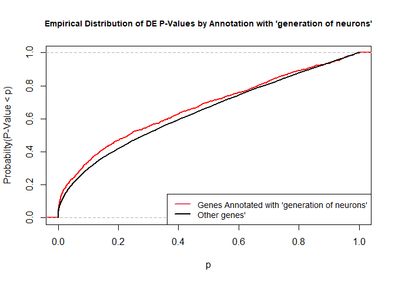
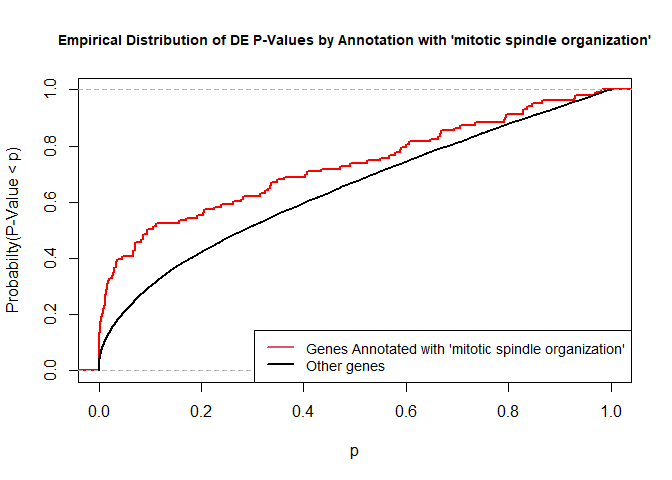
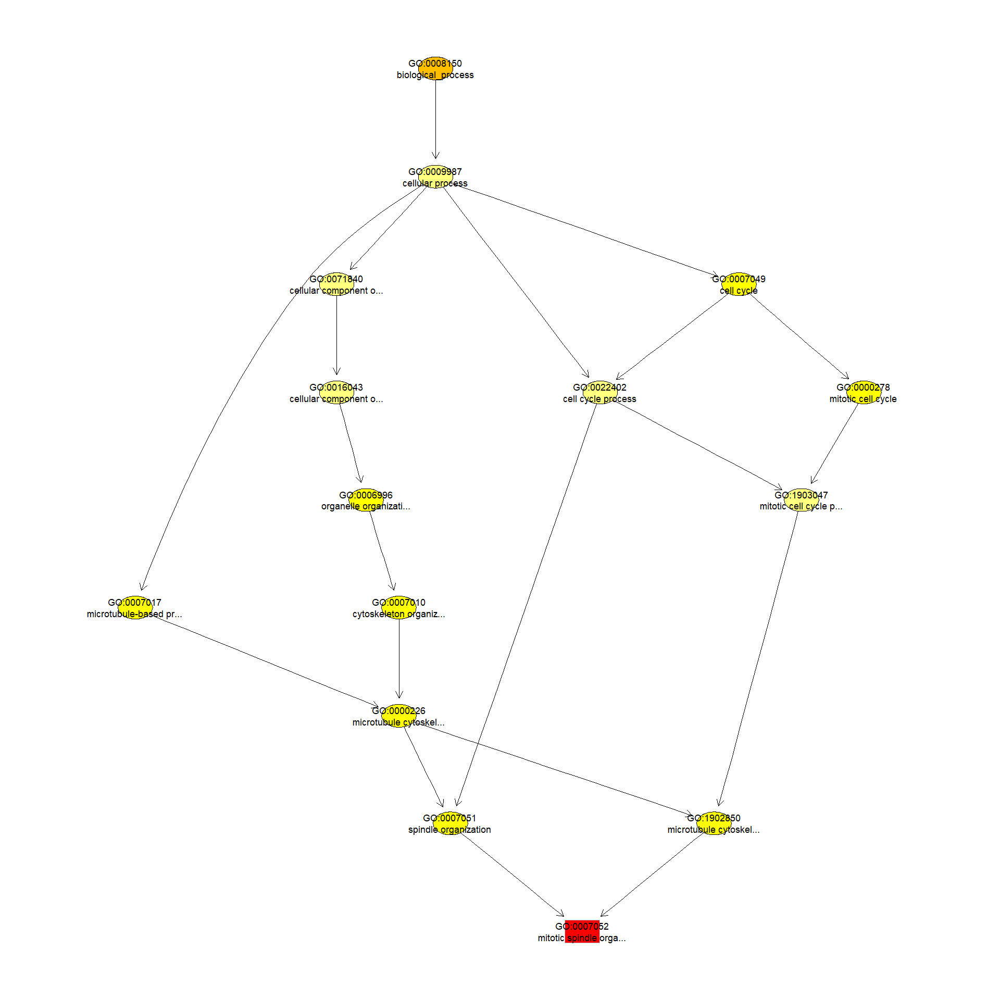
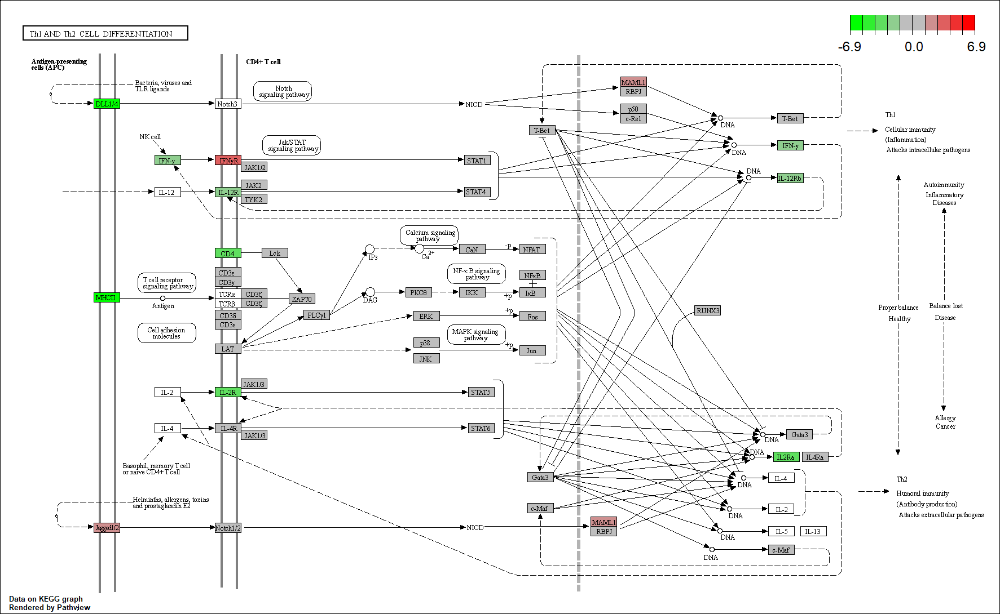

<script>
function buildQuiz(myq, qc){
  // variable to store the HTML output
  const output = [];

  // for each question...
  myq.forEach(
    (currentQuestion, questionNumber) => {

      // variable to store the list of possible answers
      const answers = [];

      // and for each available answer...
      for(letter in currentQuestion.answers){

        // ...add an HTML radio button
        answers.push(
          `<label>
            <input type="radio" name="question${questionNumber}" value="${letter}">
            ${letter} :
            ${currentQuestion.answers[letter]}
          </label><br/>`
        );
      }

      // add this question and its answers to the output
      output.push(
        `<div class="question"> ${currentQuestion.question} </div>
        <div class="answers"> ${answers.join('')} </div><br/>`
      );
    }
  );

  // finally combine our output list into one string of HTML and put it on the page
  qc.innerHTML = output.join('');
}

function showResults(myq, qc, rc){

  // gather answer containers from our quiz
  const answerContainers = qc.querySelectorAll('.answers');

  // keep track of user's answers
  let numCorrect = 0;

  // for each question...
  myq.forEach( (currentQuestion, questionNumber) => {

    // find selected answer
    const answerContainer = answerContainers[questionNumber];
    const selector = `input[name=question${questionNumber}]:checked`;
    const userAnswer = (answerContainer.querySelector(selector) || {}).value;

    // if answer is correct
    if(userAnswer === currentQuestion.correctAnswer){
      // add to the number of correct answers
      numCorrect++;

      // color the answers green
      answerContainers[questionNumber].style.color = 'lightgreen';
    }
    // if answer is wrong or blank
    else{
      // color the answers red
      answerContainers[questionNumber].style.color = 'red';
    }
  });

  // show number of correct answers out of total
  rc.innerHTML = `${numCorrect} out of ${myq.length}`;
}
</script>


# GO AND KEGG Enrichment Analysis

Load libraries

```r
library(topGO)
```

<div class='r_output'> Loading required package: BiocGenerics
</div>
<div class='r_output'> 
 Attaching package: 'BiocGenerics'
</div>
<div class='r_output'> The following objects are masked from 'package:stats':
 
     IQR, mad, sd, var, xtabs
</div>
<div class='r_output'> The following objects are masked from 'package:base':
 
     anyDuplicated, append, as.data.frame, basename, cbind, colnames,
     dirname, do.call, duplicated, eval, evalq, Filter, Find, get, grep,
     grepl, intersect, is.unsorted, lapply, Map, mapply, match, mget,
     order, paste, pmax, pmax.int, pmin, pmin.int, Position, rank,
     rbind, Reduce, rownames, sapply, setdiff, sort, table, tapply,
     union, unique, unsplit, which.max, which.min
</div>
<div class='r_output'> Loading required package: graph
</div>
<div class='r_output'> Loading required package: Biobase
</div>
<div class='r_output'> Welcome to Bioconductor
 
     Vignettes contain introductory material; view with
     'browseVignettes()'. To cite Bioconductor, see
     'citation("Biobase")', and for packages 'citation("pkgname")'.
</div>
<div class='r_output'> Loading required package: GO.db
</div>
<div class='r_output'> Loading required package: AnnotationDbi
</div>
<div class='r_output'> Loading required package: stats4
</div>
<div class='r_output'> Loading required package: IRanges
</div>
<div class='r_output'> Loading required package: S4Vectors
</div>
<div class='r_output'> 
 Attaching package: 'S4Vectors'
</div>
<div class='r_output'> The following objects are masked from 'package:base':
 
     expand.grid, I, unname
</div>
<div class='r_output'> 
 Attaching package: 'IRanges'
</div>
<div class='r_output'> The following object is masked from 'package:grDevices':
 
     windows
</div>
<div class='r_output'> 
</div>
<div class='r_output'> Loading required package: SparseM
</div>
<div class='r_output'> 
 Attaching package: 'SparseM'
</div>
<div class='r_output'> The following object is masked from 'package:base':
 
     backsolve
</div>
<div class='r_output'> 
 groupGOTerms: 	GOBPTerm, GOMFTerm, GOCCTerm environments built.
</div>
<div class='r_output'> 
 Attaching package: 'topGO'
</div>
<div class='r_output'> The following object is masked from 'package:IRanges':
 
     members
</div>
```r
library(KEGGREST)
library(org.Mm.eg.db)
```

<div class='r_output'> 
</div>
```r
library(pathview)
```

<div class='r_output'> 
</div>
<div class='r_output'> 
 Pathview is an open source software package distributed under GNU General
 Public License version 3 (GPLv3). Details of GPLv3 is available at
 http://www.gnu.org/licenses/gpl-3.0.html. Particullary, users are required to
 formally cite the original Pathview paper (not just mention it) in publications
 or products. For details, do citation("pathview") within R.
 
 The pathview downloads and uses KEGG data. Non-academic uses may require a KEGG
 license agreement (details at http://www.kegg.jp/kegg/legal.html).
 
</div>
Files for examples created in the DE analysis

## Gene Ontology (GO) Enrichment

[Gene ontology](http://www.geneontology.org/) provides a controlled vocabulary for describing biological processes (BP ontology), molecular functions (MF ontology) and cellular components (CC ontology)

The GO ontologies themselves are organism-independent; terms are associated with genes for a specific organism through direct experimentation or through sequence homology with another organism and its GO annotation.

Terms are related to other terms through parent-child relationships in a directed acylic graph.

Enrichment analysis provides one way of drawing conclusions about a set of differential expression results.

**1\.** topGO Example Using Kolmogorov-Smirnov Testing
Our first example uses Kolmogorov-Smirnov Testing for enrichment testing of our mouse DE results, with GO annotation obtained from the Bioconductor database org.Mm.eg.db.

The first step in each topGO analysis is to create a topGOdata object.  This contains the genes, the score for each gene (here we use the p-value from the DE test), the GO terms associated with each gene, and the ontology to be used (here we use the biological process ontology)

```r
infile <- "naive_v_memory.txt"
tmp <- read.delim(infile)

geneList <- tmp$P.Value
xx <- as.list(org.Mm.egENSEMBL2EG)
names(geneList) <- xx[tmp$Gene.stable.ID] # Convert to entrezgene IDs
head(geneList)
```

<div class='r_output'>        21414        83490        13609        16362        14945        14938 
 1.124296e-08 1.627415e-08 1.922338e-08 3.165608e-08 3.520442e-08 6.790147e-08
</div>
```r
# Create topGOData object
GOdata <- new("topGOdata",
	ontology = "BP",
	allGenes = geneList,
	geneSelectionFun = function(x)x,
	annot = annFUN.org , mapping = "org.Mm.eg.db")
```

<div class='r_output'> 
 Building most specific GOs .....
</div>
<div class='r_output'> 	( 10766 GO terms found. )
</div>
<div class='r_output'> 
 Build GO DAG topology ..........
</div>
<div class='r_output'> 	( 14415 GO terms and 32761 relations. )
</div>
<div class='r_output'> 
 Annotating nodes ...............
</div>
<div class='r_output'> 	( 11359 genes annotated to the GO terms. )
</div>
**2\.** The topGOdata object is then used as input for enrichment testing:

```r
# Kolmogorov-Smirnov testing
resultKS <- runTest(GOdata, algorithm = "weight01", statistic = "ks")
```

<div class='r_output'> 
 			 -- Weight01 Algorithm -- 
 
 		 the algorithm is scoring 14415 nontrivial nodes
 		 parameters: 
 			 test statistic: ks
 			 score order: increasing
</div>
<div class='r_output'> 
 	 Level 20:	1 nodes to be scored	(0 eliminated genes)
</div>
<div class='r_output'> 
 	 Level 19:	9 nodes to be scored	(0 eliminated genes)
</div>
<div class='r_output'> 
 	 Level 18:	21 nodes to be scored	(2 eliminated genes)
</div>
<div class='r_output'> 
 	 Level 17:	42 nodes to be scored	(29 eliminated genes)
</div>
<div class='r_output'> 
 	 Level 16:	92 nodes to be scored	(65 eliminated genes)
</div>
<div class='r_output'> 
 	 Level 15:	192 nodes to be scored	(138 eliminated genes)
</div>
<div class='r_output'> 
 	 Level 14:	368 nodes to be scored	(370 eliminated genes)
</div>
<div class='r_output'> 
 	 Level 13:	672 nodes to be scored	(814 eliminated genes)
</div>
<div class='r_output'> 
 	 Level 12:	1153 nodes to be scored	(1756 eliminated genes)
</div>
<div class='r_output'> 
 	 Level 11:	1627 nodes to be scored	(3407 eliminated genes)
</div>
<div class='r_output'> 
 	 Level 10:	2063 nodes to be scored	(5021 eliminated genes)
</div>
<div class='r_output'> 
 	 Level 9:	2165 nodes to be scored	(6283 eliminated genes)
</div>
<div class='r_output'> 
 	 Level 8:	1957 nodes to be scored	(7514 eliminated genes)
</div>
<div class='r_output'> 
 	 Level 7:	1670 nodes to be scored	(8480 eliminated genes)
</div>
<div class='r_output'> 
 	 Level 6:	1221 nodes to be scored	(9192 eliminated genes)
</div>
<div class='r_output'> 
 	 Level 5:	683 nodes to be scored	(9671 eliminated genes)
</div>
<div class='r_output'> 
 	 Level 4:	327 nodes to be scored	(9968 eliminated genes)
</div>
<div class='r_output'> 
 	 Level 3:	127 nodes to be scored	(10097 eliminated genes)
</div>
<div class='r_output'> 
 	 Level 2:	24 nodes to be scored	(10157 eliminated genes)
</div>
<div class='r_output'> 
 	 Level 1:	1 nodes to be scored	(10205 eliminated genes)
</div>
```r
tab <- GenTable(GOdata, raw.p.value = resultKS, topNodes = length(resultKS@score), numChar = 120)
```

topGO by default preferentially tests more specific terms, utilizing the topology of the GO graph. The algorithms used are described in detail [here](https://academic.oup.com/bioinformatics/article/22/13/1600/193669).


```r
head(tab, 15)
```

<div class='r_output'>         GO.ID
 1  GO:0007052
 2  GO:0007608
 3  GO:0035556
 4  GO:0018105
 5  GO:0010498
 6  GO:0051382
 7  GO:0007623
 8  GO:0042776
 9  GO:0010592
 10 GO:0007186
 11 GO:0000070
 12 GO:0035278
 13 GO:0051301
 14 GO:0090050
 15 GO:0046827
                                                                        Term
 1                                              mitotic spindle organization
 2                                               sensory perception of smell
 3                                         intracellular signal transduction
 4                                           peptidyl-serine phosphorylation
 5                                     proteasomal protein catabolic process
 6                                                      kinetochore assembly
 7                                                          circadian rhythm
 8                      mitochondrial ATP synthesis coupled proton transport
 9                             positive regulation of lamellipodium assembly
 10                             G protein-coupled receptor signaling pathway
 11                                     mitotic sister chromatid segregation
 12                                 miRNA mediated inhibition of translation
 13                                                            cell division
 14 positive regulation of cell migration involved in sprouting angiogenesis
 15                       positive regulation of protein export from nucleus
    Annotated Significant Expected raw.p.value
 1        103         103      103     2.5e-05
 2         75          75       75     3.4e-05
 3       1763        1763     1763     9.9e-05
 4        239         239      239     0.00010
 5        428         428      428     0.00012
 6         17          17       17     0.00025
 7        140         140      140     0.00029
 8         15          15       15     0.00034
 9         23          23       23     0.00035
 10       362         362      362     0.00048
 11       142         142      142     0.00065
 12        14          14       14     0.00065
 13       484         484      484     0.00067
 14        15          15       15     0.00088
 15        18          18       18     0.00096
</div>
* Annotated: number of genes (in our gene list) that are annotated with the term
* Significant: n/a for this example, same as Annotated here
* Expected: n/a for this example, same as Annotated here
* raw.p.value: P-value from Kolomogorov-Smirnov test that DE p-values annotated with the term are smaller (i.e. more significant) than those not annotated with the term.

The Kolmogorov-Smirnov test directly compares two probability distributions based on their maximum distance.  

To illustrate the KS test, we plot probability distributions of p-values that are and that are not annotated with the term GO:0048699 "generation of neurons" (1008 genes)m p-value 1.000.  (This won't exactly match what topGO does due to their elimination algorithm):


```r
rna.pp.terms <- genesInTerm(GOdata)[["GO:0048699"]] # get genes associated with term
p.values.in <- geneList[names(geneList) %in% rna.pp.terms]
p.values.out <- geneList[!(names(geneList) %in% rna.pp.terms)]
plot.ecdf(p.values.in, verticals = T, do.points = F, col = "red", lwd = 2, xlim = c(0,1),
          main = "Empirical Distribution of DE P-Values by Annotation with 'generation of neurons'",
          cex.main = 0.9, xlab = "p", ylab = "Probabilty(P-Value < p)")
ecdf.out <- ecdf(p.values.out)
xx <- unique(sort(c(seq(0, 1, length = 201), knots(ecdf.out))))
lines(xx, ecdf.out(xx), col = "black", lwd = 2)
legend("bottomright", legend = c("Genes Annotated with 'generation of neurons'", "Other genes'"), lwd = 2, col = 2:1, cex = 0.9)
```

<!-- -->

versus the probability distributions of p-values that are and that are not annotated with the term GO:0007052 "mitotic spindle organization" (103 genes) p-value 2.5x10-5.


```r
rna.pp.terms <- genesInTerm(GOdata)[["GO:0007052"]] # get genes associated with term
p.values.in <- geneList[names(geneList) %in% rna.pp.terms]
p.values.out <- geneList[!(names(geneList) %in% rna.pp.terms)]
plot.ecdf(p.values.in, verticals = T, do.points = F, col = "red", lwd = 2, xlim = c(0,1),
          main = "Empirical Distribution of DE P-Values by Annotation with 'mitotic spindle organization'",
          cex.main = 0.9, xlab = "p", ylab = "Probabilty(P-Value < p)")
ecdf.out <- ecdf(p.values.out)
xx <- unique(sort(c(seq(0, 1, length = 201), knots(ecdf.out))))
lines(xx, ecdf.out(xx), col = "black", lwd = 2)
legend("bottomright", legend = c("Genes Annotated with 'mitotic spindle organization'", "Other genes"), lwd = 2, col = 2:1, cex = 0.9)
```

<!-- -->


We can use the function showSigOfNodes to plot the GO graph for the most significant term and its parents, color coded by enrichment p-value (red is most significant):

```r
par(cex = 0.3)
showSigOfNodes(GOdata, score(resultKS), firstSigNodes = 1, useInfo = "def")
```

<div class='r_output'> Loading required package: Rgraphviz
</div>
<div class='r_output'> Loading required package: grid
</div>
<div class='r_output'> 
 Attaching package: 'grid'
</div>
<div class='r_output'> The following object is masked from 'package:topGO':
 
     depth
</div>
<div class='r_output'> 
 Attaching package: 'Rgraphviz'
</div>
<div class='r_output'> The following objects are masked from 'package:IRanges':
 
     from, to
</div>
<div class='r_output'> The following objects are masked from 'package:S4Vectors':
 
     from, to
</div>
<!-- -->

<div class='r_output'> $dag
 A graphNEL graph with directed edges
 Number of Nodes = 15 
 Number of Edges = 20 
 
 $complete.dag
 [1] "A graph with 15 nodes."
</div>
```r
par(cex = 1)
```

**3\.** topGO Example Using Fisher's Exact Test

Next, we use Fisher's exact test to test for GO enrichment among significantly DE genes.

Create topGOdata object:

```r
# Create topGOData object
GOdata <- new("topGOdata",
	ontology = "BP",
	allGenes = geneList,
	geneSelectionFun = function(x) (x < 0.05),
	annot = annFUN.org , mapping = "org.Mm.eg.db")
```

<div class='r_output'> 
 Building most specific GOs .....
</div>
<div class='r_output'> 	( 10766 GO terms found. )
</div>
<div class='r_output'> 
 Build GO DAG topology ..........
</div>
<div class='r_output'> 	( 14415 GO terms and 32761 relations. )
</div>
<div class='r_output'> 
 Annotating nodes ...............
</div>
<div class='r_output'> 	( 11359 genes annotated to the GO terms. )
</div>
Run Fisher's Exact Test:

```r
resultFisher <- runTest(GOdata, algorithm = "elim", statistic = "fisher")
```

<div class='r_output'> 
 			 -- Elim Algorithm -- 
 
 		 the algorithm is scoring 10040 nontrivial nodes
 		 parameters: 
 			 test statistic: fisher
 			 cutOff: 0.01
</div>
<div class='r_output'> 
 	 Level 20:	1 nodes to be scored	(0 eliminated genes)
</div>
<div class='r_output'> 
 	 Level 19:	8 nodes to be scored	(0 eliminated genes)
</div>
<div class='r_output'> 
 	 Level 18:	13 nodes to be scored	(0 eliminated genes)
</div>
<div class='r_output'> 
 	 Level 17:	24 nodes to be scored	(15 eliminated genes)
</div>
<div class='r_output'> 
 	 Level 16:	58 nodes to be scored	(15 eliminated genes)
</div>
<div class='r_output'> 
 	 Level 15:	129 nodes to be scored	(22 eliminated genes)
</div>
<div class='r_output'> 
 	 Level 14:	226 nodes to be scored	(57 eliminated genes)
</div>
<div class='r_output'> 
 	 Level 13:	389 nodes to be scored	(217 eliminated genes)
</div>
<div class='r_output'> 
 	 Level 12:	664 nodes to be scored	(1229 eliminated genes)
</div>
<div class='r_output'> 
 	 Level 11:	1007 nodes to be scored	(1448 eliminated genes)
</div>
<div class='r_output'> 
 	 Level 10:	1358 nodes to be scored	(1759 eliminated genes)
</div>
<div class='r_output'> 
 	 Level 9:	1517 nodes to be scored	(2091 eliminated genes)
</div>
<div class='r_output'> 
 	 Level 8:	1421 nodes to be scored	(2862 eliminated genes)
</div>
<div class='r_output'> 
 	 Level 7:	1269 nodes to be scored	(3412 eliminated genes)
</div>
<div class='r_output'> 
 	 Level 6:	966 nodes to be scored	(3787 eliminated genes)
</div>
<div class='r_output'> 
 	 Level 5:	569 nodes to be scored	(4752 eliminated genes)
</div>
<div class='r_output'> 
 	 Level 4:	279 nodes to be scored	(5561 eliminated genes)
</div>
<div class='r_output'> 
 	 Level 3:	118 nodes to be scored	(5696 eliminated genes)
</div>
<div class='r_output'> 
 	 Level 2:	23 nodes to be scored	(6363 eliminated genes)
</div>
<div class='r_output'> 
 	 Level 1:	1 nodes to be scored	(6363 eliminated genes)
</div>
```r
tab <- GenTable(GOdata, raw.p.value = resultFisher, topNodes = length(resultFisher@score),
				numChar = 120)
head(tab)
```

<div class='r_output'>        GO.ID                                         Term Annotated Significant
 1 GO:0032465                    regulation of cytokinesis        67          32
 2 GO:0007052                 mitotic spindle organization       103          42
 3 GO:0007186 G protein-coupled receptor signaling pathway       362         113
 4 GO:0007608                  sensory perception of smell        75          32
 5 GO:0051016            barbed-end actin filament capping        21          13
 6 GO:1902969                      mitotic DNA replication        14          10
   Expected raw.p.value
 1    14.97     3.8e-06
 2    23.01     1.9e-05
 3    80.87     4.5e-05
 4    16.75     6.5e-05
 5     4.69     0.00011
 6     3.13     0.00012
</div>* Annotated: number of genes (in our gene list) that are annotated with the term
* Significant: Number of significantly DE genes annotated with that term (i.e. genes where geneList = 1)
* Expected: Under random chance, number of genes that would be expected to be significantly DE and annotated with that term
* raw.p.value: P-value from Fisher's Exact Test, testing for association between significance and pathway membership.

Fisher's Exact Test is applied to the table:

**Significance/Annotation**|**Annotated With GO Term**|**Not Annotated With GO Term**
:-----:|:-----:|:-----:
**Significantly DE**|n1|n3
**Not Significantly DE**|n2|n4

and compares the probability of the observed table, conditional on the row and column sums, to what would be expected under random chance.  

Advantages over KS (or Wilcoxon) Tests:

* Ease of interpretation

* Easier directional testing

Disadvantages:

* Relies on significant/non-significant dichotomy (an interesting gene could have an adjusted p-value of 0.051 and be counted as non-significant)
* Less powerful
* May be less useful if there are very few (or a large number of) significant genes

## Quiz 1

<div id="quiz1" class="quiz"></div>
<button id="submit1">Submit Quiz</button>
<div id="results1" class="output"></div>
<script>
quizContainer1 = document.getElementById('quiz1');
resultsContainer1 = document.getElementById('results1');
submitButton1 = document.getElementById('submit1');

myQuestions1 = [
  {
    question: "Rerun the KS test analysis using the molecular function (MF) ontology.  What is the top GO term listed?",
    answers: {
      a: "olfactory receptor activity",
      b: "angiogenesis",
      c: "calcium ion binding"
    },
    correctAnswer: "a"
  },
  {
      question: "How many genes from the top table are annotated with the term 'protein serine/threonine kinase activity'",
    answers: {
      a: "103",
      b: "75",
      c: "328"
    },
    correctAnswer: "c"
  },
  {
      question: "Based on the graph above generated by showSigOfNodes, what is one parent term of 'mitotic spindle organization'?",
    answers: {
      a: "metabolic process",
      b: "spindle organization",
      c: "angiogenesis"
    },
    correctAnswer: "b"
  }
];

buildQuiz(myQuestions1, quizContainer1);
submitButton1.addEventListener('click', function() {showResults(myQuestions1, quizContainer1, resultsContainer1);});
</script>

##. KEGG Pathway Enrichment Testing With KEGGREST
KEGG, the Kyoto Encyclopedia of Genes and Genomes (https://www.genome.jp/kegg/), provides assignment of genes for many organisms into pathways.

We will access KEGG pathway assignments for mouse through the KEGGREST Bioconductor package, and then use some homebrew code for enrichment testing.

**1\.** Get all mouse pathways and their genes:

```r
# Pull all pathways for mmu
pathways.list <- keggList("pathway", "mmu")
head(pathways.list)
```

<div class='r_output'>                                                     path:mmu00010 
             "Glycolysis / Gluconeogenesis - Mus musculus (mouse)" 
                                                     path:mmu00020 
                "Citrate cycle (TCA cycle) - Mus musculus (mouse)" 
                                                     path:mmu00030 
                "Pentose phosphate pathway - Mus musculus (mouse)" 
                                                     path:mmu00040 
 "Pentose and glucuronate interconversions - Mus musculus (mouse)" 
                                                     path:mmu00051 
          "Fructose and mannose metabolism - Mus musculus (mouse)" 
                                                     path:mmu00052 
                     "Galactose metabolism - Mus musculus (mouse)"
</div>
```r
# Pull all genes for each pathway
pathway.codes <- sub("path:", "", names(pathways.list))
genes.by.pathway <- sapply(pathway.codes,
	function(pwid){
		pw <- keggGet(pwid)
		if (is.null(pw[[1]]$GENE)) return(NA)
		pw2 <- pw[[1]]$GENE[c(TRUE,FALSE)] 
		pw2 <- unlist(lapply(strsplit(pw2, split = ";", fixed = T), function(x)x[1]))
		return(pw2)
	}
)
head(genes.by.pathway)
```

<div class='r_output'> $mmu00010
  [1] "15277"     "212032"    "15275"     "216019"    "103988"    "14751"    
  [7] "18641"     "18642"     "56421"     "14121"     "14120"     "11674"    
 [13] "230163"    "11676"     "353204"    "79459"     "21991"     "14433"    
 [19] "115487111" "14447"     "18655"     "18663"     "18648"     "56012"    
 [25] "13806"     "13807"     "13808"     "433182"    "226265"    "18746"    
 [31] "18770"     "18597"     "18598"     "68263"     "235339"    "13382"    
 [37] "16828"     "16832"     "16833"     "106557"    "11522"     "11529"    
 [43] "26876"     "11532"     "58810"     "11669"     "11671"     "72535"    
 [49] "110695"    "56752"     "11670"     "67689"     "621603"    "73458"    
 [55] "68738"     "60525"     "319625"    "72157"     "66681"     "14377"    
 [61] "14378"     "68401"     "72141"     "12183"     "17330"     "18534"    
 [67] "74551"    
 
 $mmu00020
  [1] "12974"  "71832"  "104112" "11429"  "11428"  "15926"  "269951" "15929" 
  [9] "67834"  "170718" "243996" "18293"  "239017" "78920"  "13382"  "56451" 
 [17] "20917"  "20916"  "66945"  "67680"  "66052"  "66925"  "14194"  "17449" 
 [25] "17448"  "18563"  "18534"  "74551"  "18597"  "18598"  "68263"  "235339"
 
 $mmu00030
  [1] "14751"  "14380"  "14381"  "66171"  "100198" "110208" "66646"  "21881" 
  [9] "83553"  "74419"  "21351"  "19895"  "232449" "71336"  "72157"  "66681" 
 [17] "19139"  "110639" "328099" "75456"  "19733"  "75731"  "235582" "11674" 
 [25] "230163" "11676"  "353204" "79459"  "14121"  "14120"  "18641"  "18642" 
 [33] "56421" 
 
 $mmu00040
  [1] "110006" "16591"  "22238"  "22236"  "94284"  "94215"  "394434" "394430"
  [9] "394432" "394433" "72094"  "552899" "71773"  "394435" "394436" "100727"
 [17] "231396" "100559" "112417" "243085" "613123" "22235"  "216558" "58810" 
 [25] "68631"  "66646"  "102448" "11997"  "14187"  "11677"  "67861"  "67880" 
 [33] "20322"  "71755"  "75847" 
 
 $mmu00051
  [1] "110119" "54128"  "29858"  "331026" "69080"  "218138" "22122"  "75540" 
  [9] "234730" "15277"  "212032" "15275"  "216019" "18641"  "18642"  "56421" 
 [17] "14121"  "14120"  "18639"  "18640"  "170768" "270198" "319801" "16548" 
 [25] "20322"  "11997"  "14187"  "11677"  "67861"  "11674"  "230163" "11676" 
 [33] "353204" "79459"  "21991"  "225913"
 
 $mmu00052
  [1] "319625" "14635"  "14430"  "74246"  "216558" "72157"  "66681"  "15277" 
  [9] "212032" "15275"  "216019" "103988" "14377"  "14378"  "68401"  "12091" 
 [17] "226413" "16770"  "14595"  "53418"  "11605"  "11997"  "14187"  "11677" 
 [25] "67861"  "18641"  "18642"  "56421"  "232714" "14387"  "76051"  "69983"
</div>
Read in DE file to be used in enrichment testing:

```r
head(geneList)
```

<div class='r_output'>        21414        83490        13609        16362        14945        14938 
 1.124296e-08 1.627415e-08 1.922338e-08 3.165608e-08 3.520442e-08 6.790147e-08
</div>
**2\.** Apply Wilcoxon rank-sum test to each pathway, testing if "in" p-values are smaller than "out" p-values:

```r
# Wilcoxon test for each pathway
pVals.by.pathway <- t(sapply(names(genes.by.pathway),
	function(pathway) {
		pathway.genes <- genes.by.pathway[[pathway]]
		list.genes.in.pathway <- intersect(names(geneList), pathway.genes)
		list.genes.not.in.pathway <- setdiff(names(geneList), list.genes.in.pathway)
		scores.in.pathway <- geneList[list.genes.in.pathway]
		scores.not.in.pathway <- geneList[list.genes.not.in.pathway]
		if (length(scores.in.pathway) > 0){
			p.value <- wilcox.test(scores.in.pathway, scores.not.in.pathway, alternative = "less")$p.value
		} else{
			p.value <- NA
		}
		return(c(p.value = p.value, Annotated = length(list.genes.in.pathway)))
	}
))

# Assemble output table
outdat <- data.frame(pathway.code = rownames(pVals.by.pathway))
outdat$pathway.name <- pathways.list[paste0("path:",outdat$pathway.code)]
outdat$p.value <- pVals.by.pathway[,"p.value"]
outdat$Annotated <- pVals.by.pathway[,"Annotated"]
outdat <- outdat[order(outdat$p.value),]
head(outdat, 15)
```

<div class='r_output'>     pathway.code
 215     mmu04740
 340     mmu05415
 269     mmu05020
 264     mmu05010
 242     mmu04932
 341     mmu05416
 334     mmu05330
 301     mmu05200
 193     mmu04658
 335     mmu05332
 330     mmu05320
 174     mmu04514
 331     mmu05321
 106     mmu03030
 270     mmu05022
                                                                 pathway.name
 215                            Olfactory transduction - Mus musculus (mouse)
 340                           Diabetic cardiomyopathy - Mus musculus (mouse)
 269                                     Prion disease - Mus musculus (mouse)
 264                                 Alzheimer disease - Mus musculus (mouse)
 242                 Non-alcoholic fatty liver disease - Mus musculus (mouse)
 341                                 Viral myocarditis - Mus musculus (mouse)
 334                               Allograft rejection - Mus musculus (mouse)
 301                                Pathways in cancer - Mus musculus (mouse)
 193                  Th1 and Th2 cell differentiation - Mus musculus (mouse)
 335                         Graft-versus-host disease - Mus musculus (mouse)
 330                        Autoimmune thyroid disease - Mus musculus (mouse)
 174                           Cell adhesion molecules - Mus musculus (mouse)
 331                        Inflammatory bowel disease - Mus musculus (mouse)
 106                                   DNA replication - Mus musculus (mouse)
 270 Pathways of neurodegeneration - multiple diseases - Mus musculus (mouse)
          p.value Annotated
 215 2.214277e-06        88
 340 2.260240e-06       160
 269 3.147476e-06       216
 264 1.129108e-05       292
 242 1.223252e-05       124
 341 2.009046e-05        50
 334 2.762872e-05        29
 301 3.440934e-05       356
 193 4.016787e-05        74
 335 5.295053e-05        30
 330 8.420246e-05        29
 174 9.039036e-05        82
 331 1.542396e-04        40
 106 1.716499e-04        35
 270 2.982266e-04       355
</div>* p.value: P-value for Wilcoxon rank-sum testing, testing that p-values from DE analysis for genes in the pathway are smaller than those not in the pathway
* Annotated: Number of genes in the pathway (regardless of DE p-value)

The Wilcoxon rank-sum test is the nonparametric analogue of the two-sample t-test.  It compares the ranks of observations in two groups.  It is more powerful than the Kolmogorov-Smirnov test for location tests.

**2\.** Plotting Pathways

```r
foldChangeList <- tmp$logFC
xx <- as.list(org.Mm.egENSEMBL2EG)
names(foldChangeList) <- xx[tmp$Gene.stable.ID]
head(foldChangeList)
```

<div class='r_output'>     21414     83490     13609     16362     14945     14938 
  1.130285 -1.682138  1.502989  1.145045 -3.575618 -2.546520
</div>
```r
mmu04658 <- pathview(gene.data  = foldChangeList,
                     pathway.id = "mmu04658",
                     species    = "mmu",
                     limit      = list(gene=max(abs(foldChangeList)), cpd=1))
```

<div class='r_output'> 'select()' returned 1:1 mapping between keys and columns
</div>
<div class='r_output'> Info: Working in directory C:/Users/bpdurbin/Desktop/GGI_DE_course
</div>
<div class='r_output'> Info: Writing image file mmu04658.pathview.png
</div>
<div class='r_output'> Info: some node width is different from others, and hence adjusted!
</div>


## Quiz 2

<div id="quiz2" class="quiz"></div>
<button id="submit2">Submit Quiz</button>
<div id="results2" class="output"></div>
<script>
quizContainer2 = document.getElementById('quiz2');
resultsContainer2 = document.getElementById('results2');
submitButton2 = document.getElementById('submit2');

myQuestions2 = [
  {
    question: "How many pathways have a p-value less than 0.05?",
    answers: {
      a: "105",
      b: "343",
      c: "133"
    },
    correctAnswer: "a"
  },
  {
      question: "Which pathway has the most genes annotated to it (excluding genes not in the top table)?'",
    answers: {
      a: "Olfactory transduction - Mus musculus (mouse)",
      b: "Metabolic pathways - Mus musculus (mouse)",
      c: "Pathways in cancer - Mus musculus (mouse)"
    },
    correctAnswer: "c"
  },
  {
      question: "Make a pathview diagram for mmu04740, and locate the file mmu04740.pathview.png on your computer.  What sign does the log fold change for MHCII have?",
    answers: {
      a: "Positive",
      b: "Negative"
    },
    correctAnswer: "b"
  }
];

buildQuiz(myQuestions2, quizContainer2);
submitButton2.addEventListener('click', function() {showResults(myQuestions2, quizContainer2, resultsContainer2);});
</script>


```r
sessionInfo()
```

<div class='r_output'> R version 4.1.3 (2022-03-10)
 Platform: x86_64-w64-mingw32/x64 (64-bit)
 Running under: Windows 10 x64 (build 19044)
 
 Matrix products: default
 
 locale:
 [1] LC_COLLATE=English_United States.1252 
 [2] LC_CTYPE=English_United States.1252   
 [3] LC_MONETARY=English_United States.1252
 [4] LC_NUMERIC=C                          
 [5] LC_TIME=English_United States.1252    
 
 attached base packages:
 [1] grid      stats4    stats     graphics  grDevices datasets  utils    
 [8] methods   base     
 
 other attached packages:
  [1] Rgraphviz_2.38.0     pathview_1.34.0      org.Mm.eg.db_3.14.0 
  [4] KEGGREST_1.34.0      topGO_2.46.0         SparseM_1.81        
  [7] GO.db_3.14.0         AnnotationDbi_1.56.2 IRanges_2.28.0      
 [10] S4Vectors_0.32.4     Biobase_2.54.0       graph_1.72.0        
 [13] BiocGenerics_0.40.0 
 
 loaded via a namespace (and not attached):
  [1] xfun_0.30              bslib_0.3.1            lattice_0.20-45       
  [4] vctrs_0.4.0            htmltools_0.5.2        yaml_2.3.5            
  [7] XML_3.99-0.9           blob_1.2.3             rlang_1.0.2           
 [10] jquerylib_0.1.4        DBI_1.1.2              bit64_4.0.5           
 [13] matrixStats_0.61.0     GenomeInfoDbData_1.2.7 stringr_1.4.0         
 [16] zlibbioc_1.40.0        Biostrings_2.62.0      memoise_2.0.1         
 [19] evaluate_0.15          knitr_1.38             fastmap_1.1.0         
 [22] GenomeInfoDb_1.30.1    curl_4.3.2             highr_0.9             
 [25] Rcpp_1.0.8.3           renv_0.15.4            cachem_1.0.6          
 [28] org.Hs.eg.db_3.14.0    jsonlite_1.8.0         XVector_0.34.0        
 [31] bit_4.0.4              png_0.1-7              digest_0.6.29         
 [34] stringi_1.7.6          cli_3.2.0              tools_4.1.3           
 [37] bitops_1.0-7           magrittr_2.0.3         sass_0.4.1            
 [40] RCurl_1.98-1.6         RSQLite_2.2.12         crayon_1.5.1          
 [43] pkgconfig_2.0.3        KEGGgraph_1.54.0       rmarkdown_2.13        
 [46] httr_1.4.2             R6_2.5.1               compiler_4.1.3
</div>